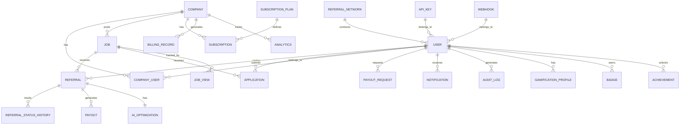

# TRM Platform - Database Schema Documentation

## Table of Contents
1. [Overview](#overview)
2. [Entity Relationship Diagram](#entity-relationship-diagram)
3. [Collection Schemas](#collection-schemas)
4. [Indexes](#indexes)
5. [Data Flow](#data-flow)
6. [Migration Guide](#migration-guide)

---

## Overview

### Database Technology
- **Type**: MongoDB (NoSQL Document Database)
- **ODM**: Mongoose
- **Version**: 6.x
- **Primary Database**: `saramart-referral`

### Design Principles
1. **Document-Oriented**: Related data embedded where appropriate
2. **Flexible Schema**: Supports evolving requirements
3. **Indexing Strategy**: Optimized for read-heavy operations
4. **Data Integrity**: Application-level validation and references

---

## Entity Relationship Diagram



---

## Collection Schemas

### 1. Users Collection

**Purpose**: Stores all user accounts (referrers, job seekers, corporate users, admins)

```javascript
{
  _id: ObjectId,
  
  // Authentication
  email: String,              // Unique, indexed, lowercase
  password: String,           // Bcrypt hashed (12 rounds)
  
  // Profile
  name: String,               // Full name
  phone: String,              // Myanmar format: 09xxxxxxxxx
  avatar: String,             // URL to image (S3 or local)
  
  // Role & Type
  role: {
    type: String,
    enum: ['platform_admin', 'corporate_admin', 'corporate_recruiter', 
           'corporate_viewer', 'referrer', 'job_seeker'],
    required: true
  },
  
  // For corporate users
  companyId: ObjectId,        // Reference to Companies (if applicable)
  
  // For referrers
  referrerProfile: {
    referralCode: String,     // Unique, auto-generated (e.g., "REF-ABC123")
    inviteCode: String,       // For network building
    parentReferrerId: ObjectId, // Upline referrer
    
    // Financial
    totalEarnings: { type: Number, default: 0 },
    availableBalance: { type: Number, default: 0 },
    pendingBalance: { type: Number, default: 0 },
    
    // Stats
    totalReferrals: { type: Number, default: 0 },
    successfulHires: { type: Number, default: 0 },
    
    // Payment Methods
    paymentMethods: [{
      type: { 
        type: String, 
        enum: ['kbzpay', 'wavepay', 'cbpay', 'bank_transfer'] 
      },
      provider: String,       // Bank name or payment provider
      accountNumber: String,  // Encrypted
      accountName: String,
      phoneNumber: String,    // For mobile payments
      isDefault: Boolean,
      isVerified: Boolean,
      createdAt: Date
    }],
    
    // KYC
    kycStatus: {
      type: String,
      enum: ['not_submitted', 'pending', 'verified', 'rejected'],
      default: 'not_submitted'
    },
    kycDocuments: {
      nrcFront: String,       // URL to image
      nrcBack: String,        // URL to image
      selfie: String,         // URL to image
      submittedAt: Date,
      reviewedAt: Date,
      reviewedBy: ObjectId,
      rejectionReason: String
    },
    
    // Gamification
    tierLevel: {
      type: String,
      enum: ['bronze', 'silver', 'gold', 'platinum'],
      default: 'bronze'
    },
    tierProgress: { type: Number, default: 0 },
    points: { type: Number, default: 0 },
    directReferrals: { type: Number, default: 0 },
    networkSize: { type: Number, default: 0 },
    networkEarnings: { type: Number, default: 0 },
    inviteCount: { type: Number, default: 0 },
    
    // AI Credits
    aiCredits: {
      monthly: { type: Number, default: 3 },
      used: { type: Number, default: 0 },
      bonus: { type: Number, default: 0 }
    }
  },
  
  // For job seekers
  jobseekerProfile: {
    resume: String,           // URL to PDF
    skills: [String],
    experience: String,       // Summary
    education: String,        // Summary
    portfolio: String,        // URL
    linkedIn: String,
    expectedSalary: {
      min: Number,
      max: Number,
      currency: { type: String, default: 'MMK' }
    },
    preferredLocations: [String],
    preferredJobTypes: [String]
  },
  
  // Notifications
  notificationPreferences: {
    email: { type: Boolean, default: true },
    inApp: { type: Boolean, default: true },
    push: { type: Boolean, default: true },
    sms: { type: Boolean, default: false }
  },
  
  // Security
  emailVerified: { type: Boolean, default: false },
  emailVerificationToken: String,
  emailVerificationExpires: Date,
  passwordResetToken: String,
  passwordResetExpires: Date,
  twoFactorSecret: String,    // For 2FA
  twoFactorEnabled: { type: Boolean, default: false },
  
  // Login tracking
  lastLoginAt: Date,
  lastLoginIp: String,
  loginAttempts: { type: Number, default: 0 },
  lockUntil: Date,
  
  // Status
  status: {
    type: String,
    enum: ['active', 'suspended', 'deleted'],
    default: 'active'
  },
  suspendedAt: Date,
  suspendedReason: String,
  suspendedBy: ObjectId,
  
  // Metadata
  createdAt: { type: Date, default: Date.now },
  updatedAt: { type: Date, default: Date.now }
}
```

**Indexes**:
```javascript
users.createIndex({ email: 1 }, { unique: true })
users.createIndex({ "referrerProfile.referralCode": 1 }, { unique: true, sparse: true })
users.createIndex({ role: 1, status: 1 })
users.createIndex({ companyId: 1 })
users.createIndex({ createdAt: -1 })
```

---

### 2. Companies Collection

**Purpose**: Stores company profiles and business information

```javascript
{
  _id: ObjectId,
  
  // Basic Info
  name: String,               // Legal company name
  slug: String,               // URL-friendly name (unique)
  description: String,        // Company description (rich text)
  shortDescription: String,   // For listings (max 200 chars)
  
  // Branding
  logo: String,               // URL to logo image
  bannerImage: String,        // URL to banner
  favicon: String,
  
  // Contact
  email: String,              // Business email
  phone: String,
  website: String,
  
  // Address
  address: {
    street: String,
    city: String,
    state: String,
    postalCode: String,
    country: { type: String, default: 'Myanmar' },
    coordinates: {
      lat: Number,
      lng: Number
    }
  },
  
  // Business Info
  industry: String,           // Industry category
  companySize: {              // Employee count
    type: String,
    enum: ['1-10', '11-50', '51-200', '201-500', '501-1000', '1000+']
  },
  foundedYear: Number,
  
  // Registration
  registrationNumber: String, // Business registration
  taxId: String,              // Tax ID
  
  // Verification
  verificationStatus: {
    type: String,
    enum: ['pending', 'verified', 'rejected'],
    default: 'pending'
  },
  verificationDocuments: {
    businessRegistration: String,
    taxCertificate: String,
    letterhead: String,
    proofOfAddress: String
  },
  verifiedAt: Date,
  verifiedBy: ObjectId,
  
  // Subscription
  currentSubscription: {
    planId: ObjectId,
    status: {
      type: String,
      enum: ['active', 'cancelled', 'expired', 'past_due'],
      default: 'active'
    },
    startedAt: Date,
    expiresAt: Date,
    autoRenew: { type: Boolean, default: true },
    cancelAtPeriodEnd: { type: Boolean, default: false }
  },
  
  // Limits
  jobPostingLimit: Number,
  activeJobCount: { type: Number, default: 0 },
  teamMemberLimit: Number,
  
  // Branding (Enterprise)
  branding: {
    primaryColor: String,
    secondaryColor: String,
    customDomain: String,
    whiteLabelEnabled: { type: Boolean, default: false }
  },
  
  // Settings
  settings: {
    requireApproval: { type: Boolean, default: false },
    defaultReferralBonus: Number,
    notificationPreferences: {
      newReferral: { type: Boolean, default: true },
      statusChange: { type: Boolean, default: true },
      dailyDigest: { type: Boolean, default: false }
    }
  },
  
  // Stats
  stats: {
    totalJobsPosted: { type: Number, default: 0 },
    totalHires: { type: Number, default: 0 },
    totalReferralSpend: { type: Number, default: 0 },
    totalSpent: { type: Number, default: 0 },
    averageTimeToHire: { type: Number, default: 0 }
  },
  
  // Social
  socialLinks: {
    linkedIn: String,
    facebook: String,
    twitter: String,
    youtube: String
  },
  
  // Culture & Benefits
  culture: String,
  benefits: [String],
  
  // Status
  status: {
    type: String,
    enum: ['active', 'suspended', 'deleted'],
    default: 'active'
  },
  
  // Metadata
  createdBy: ObjectId,        // Initial admin user
  createdAt: { type: Date, default: Date.now },
  updatedAt: { type: Date, default: Date.now }
}
```

**Indexes**:
```javascript
companies.createIndex({ slug: 1 }, { unique: true })
companies.createIndex({ "currentSubscription.status": 1 })
companies.createIndex({ verificationStatus: 1 })
companies.createIndex({ industry: 1 })
companies.createIndex({ name: 'text', description: 'text' })
```

---

### 3. Jobs Collection

**Purpose**: Stores job postings

```javascript
{
  _id: ObjectId,
  
  // Basic Info
  title: String,              // Job title
  slug: String,               // URL-friendly
  description: String,        // Full description (HTML/Markdown)
  summary: String,            // Short summary for listings
  
  // Company
  companyId: ObjectId,        // Reference to Companies
  postedBy: ObjectId,         // Reference to Users
  
  // Location
  location: {
    type: {
      type: String,
      enum: ['onsite', 'remote', 'hybrid'],
      required: true
    },
    city: String,
    state: String,
    country: { type: String, default: 'Myanmar' },
    address: String
  },
  
  // Employment Details
  employmentType: {
    type: String,
    enum: ['full-time', 'part-time', 'contract', 'internship', 'freelance'],
    required: true
  },
  experienceLevel: {
    type: String,
    enum: ['entry', 'mid', 'senior', 'lead', 'executive']
  },
  
  // Salary
  salary: {
    min: Number,
    max: Number,
    currency: { type: String, default: 'MMK' },
    period: {
      type: String,
      enum: ['hourly', 'daily', 'monthly', 'yearly'],
      default: 'monthly'
    },
    isNegotiable: { type: Boolean, default: false }
  },
  
  // Requirements
  requirements: [String],     // List of requirements
  responsibilities: [String], // List of responsibilities
  qualifications: {
    education: String,
    experience: String,       // Years of experience
    skills: [String],         // Required skills
    languages: [{
      language: String,
      proficiency: {
        type: String,
        enum: ['basic', 'conversational', 'fluent', 'native']
      }
    }]
  },
  
  // Benefits
  benefits: [String],
  perks: [String],
  
  // Referral Settings
  referralBonus: Number,      // Amount in MMK
  bonusCurrency: { type: String, default: 'MMK' },
  
  // Application Settings
  applicationSettings: {
    requireResume: { type: Boolean, default: true },
    requireCoverLetter: { type: Boolean, default: false },
    customQuestions: [{
      question: String,
      type: {
        type: String,
        enum: ['text', 'textarea', 'select', 'multiselect', 'number', 'date', 'file']
      },
      required: Boolean,
      options: [String],      // For select/multiselect
      placeholder: String
    }],
    deadline: Date,
    maxApplications: Number   // Limit total applications
  },
  
  // Status
  status: {
    type: String,
    enum: ['draft', 'active', 'paused', 'closed', 'filled'],
    default: 'draft'
  },
  
  // Visibility
  isFeatured: { type: Boolean, default: false },
  isUrgent: { type: Boolean, default: false },
  isPrivate: { type: Boolean, default: false },
  
  // Categories
  category: String,
  subcategory: String,
  tags: [String],
  
  // Stats
  stats: {
    views: { type: Number, default: 0 },
    uniqueViews: { type: Number, default: 0 },
    applications: { type: Number, default: 0 },
    referrals: { type: Number, default: 0 },
    hires: { type: Number, default: 0 }
  },
  
  // SEO
  metaTitle: String,
  metaDescription: String,
  keywords: [String],
  
  // Approval
  isApproved: { type: Boolean, default: false },
  approvedBy: ObjectId,
  approvedAt: Date,
  rejectionReason: String,
  
  // Timestamps
  publishedAt: Date,
  expiresAt: Date,
  createdAt: { type: Date, default: Date.now },
  updatedAt: { type: Date, default: Date.now }
}
```

**Indexes**:
```javascript
jobs.createIndex({ companyId: 1, status: 1 })
jobs.createIndex({ status: 1, isFeatured: 1, createdAt: -1 })
jobs.createIndex({ title: 'text', description: 'text', summary: 'text' })
jobs.createIndex({ category: 1, status: 1 })
jobs.createIndex({ "location.city": 1, status: 1 })
jobs.createIndex({ employmentType: 1, status: 1 })
jobs.createIndex({ expiresAt: 1 }, { expireAfterSeconds: 0 })  // TTL for expired jobs
```

---

### 4. Referrals Collection

**Purpose**: Stores candidate referrals

```javascript
{
  _id: ObjectId,
  
  // Referral Code
  code: String,               // Unique (e.g., "REF-ABC123")
  
  // Relationships
  jobId: ObjectId,            // Reference to Jobs
  job: Object,                // Denormalized job info
  companyId: ObjectId,        // Reference to Companies
  
  referrerId: ObjectId,       // Reference to Users (referrer)
  referrer: Object,           // Denormalized referrer info
  
  // Referred Person
  referredPerson: {
    name: String,
    email: String,
    phone: String,
    currentTitle: String,
    currentCompany: String,
    resumeUrl: String,
    linkedIn: String,
    portfolio: String
  },
  
  // Or if registered user
  referredUserId: ObjectId,   // Reference to Users (optional)
  
  // Source tracking
  source: {
    channel: {
      type: String,
      enum: ['direct', 'facebook', 'linkedin', 'whatsapp', 'email', 'sms', 'qr']
    },
    ipAddress: String,
    userAgent: String,
    referrerUrl: String,
    utmSource: String,
    utmMedium: String,
    utmCampaign: String
  },
  
  // Status Pipeline
  status: {
    type: String,
    enum: [
      'draft',              // Initial creation
      'submitted',          // Referral submitted
      'under_review',       // Company reviewing
      'shortlisted',        // Passed initial screening
      'interview_scheduled', // Interview date set
      'interview_completed', // Interview done
      'offer_extended',     // Job offer sent
      'hired',              // Candidate accepted
      'rejected',           // Not selected
      'withdrawn',          // Referrer/candidate withdrew
      'expired',            // Referral expired
      'paid'                // Bonus paid
    ],
    default: 'submitted'
  },
  
  // Status History
  statusHistory: [{
    status: String,
    changedBy: ObjectId,
    changedByType: {
      type: String,
      enum: ['system', 'referrer', 'company', 'admin']
    },
    changedAt: { type: Date, default: Date.now },
    notes: String,
    metadata: Object
  }],
  
  // Financial
  referralBonus: Number,      // Original bonus amount
  platformCommission: Number, // 15%
  referrerPayout: Number,     // 85%
  perHireFee: Number,         // 50,000 MMK
  
  // Payout
  payout: {
    status: {
      type: String,
      enum: ['pending', 'approved', 'processing', 'paid', 'rejected'],
      default: 'pending'
    },
    requestedAt: Date,
    approvedBy: ObjectId,
    approvedAt: Date,
    processedBy: ObjectId,
    processedAt: Date,
    paidAt: Date,
    paymentMethod: String,
    paymentDetails: Object,    // Encrypted
    transactionId: String,
    receiptUrl: String,
    rejectionReason: String
  },
  
  // Notes
  internalNotes: String,      // Company internal notes
  referrerNotes: String,      // Notes from referrer
  candidateNotes: String,     // Notes from candidate
  
  // AI Optimization
  aiOptimization: {
    used: { type: Boolean, default: false },
    originalText: String,
    optimizedText: String,
    analysis: Object,
    creditUsed: { type: Number, default: 0 }
  },
  
  // Guarantee Period
  guaranteePeriodDays: { type: Number, default: 30 },
  guaranteePeriodEndsAt: Date,
  
  // Expiration
  expiresAt: Date,            // Auto-expire if no activity
  
  // Timestamps
  submittedAt: { type: Date, default: Date.now },
  hiredAt: Date,
  createdAt: { type: Date, default: Date.now },
  updatedAt: { type: Date, default: Date.now }
}
```

**Indexes**:
```javascript
referrals.createIndex({ code: 1 }, { unique: true })
referrals.createIndex({ referrerId: 1, status: 1 })
referrals.createIndex({ jobId: 1, status: 1 })
referrals.createIndex({ companyId: 1, status: 1 })
referrals.createIndex({ status: 1, "payout.status": 1 })
referrals.createIndex({ createdAt: -1 })
referrals.createIndex({ expiresAt: 1 }, { expireAfterSeconds: 0 })
```

---

### 5. Subscriptions Collection

**Purpose**: Stores company subscription records

```javascript
{
  _id: ObjectId,
  
  companyId: ObjectId,
  planId: ObjectId,           // Reference to SubscriptionPlans
  
  // Plan details at time of subscription
  planSnapshot: {
    name: String,
    price: Number,
    currency: String,
    features: Object
  },
  
  // Billing
  status: {
    type: String,
    enum: ['active', 'cancelled', 'expired', 'past_due', 'trialing'],
    default: 'active'
  },
  
  // Period
  currentPeriodStart: Date,
  currentPeriodEnd: Date,
  trialEndsAt: Date,
  
  // Pricing
  price: Number,
  currency: { type: String, default: 'MMK' },
  billingCycle: {
    type: String,
    enum: ['monthly', 'yearly'],
    default: 'monthly'
  },
  
  // Payment
  paymentMethod: {
    type: String,
    enum: ['kbzpay', 'wavepay', 'cbpay', 'bank_transfer', 'card']
  },
  paymentMethodDetails: Object,  // Encrypted
  
  // Renewal
  autoRenew: { type: Boolean, default: true },
  cancelAtPeriodEnd: { type: Boolean, default: false },
  
  // Cancellation
  cancelledAt: Date,
  cancellationReason: String,
  cancelledBy: ObjectId,
  
  // Stats
  totalPaid: { type: Number, default: 0 },
  invoiceCount: { type: Number, default: 0 },
  
  // Metadata
  createdAt: { type: Date, default: Date.now },
  updatedAt: { type: Date, default: Date.now }
}
```

---

### 6. SubscriptionPlans Collection

**Purpose**: Stores available subscription tiers

```javascript
{
  _id: ObjectId,
  
  // Plan Details
  name: String,               // e.g., 'Starter', 'Growth', 'Enterprise'
  slug: String,               // URL-friendly
  description: String,
  shortDescription: String,
  
  // Type
  type: {
    type: String,
    enum: ['company', 'referrer'],
    default: 'company'
  },
  
  // Pricing
  price: Number,              // Monthly price
  currency: { type: String, default: 'MMK' },
  billingCycle: {
    type: String,
    enum: ['monthly', 'yearly'],
    default: 'monthly'
  },
  yearlyDiscount: Number,     // Percentage discount
  
  // Limits
  limits: {
    jobPostingLimit: Number,  // -1 for unlimited
    activeJobLimit: Number,
    userLimit: Number,        // Team members
    storageLimit: Number,     // In MB
    apiCallsPerMonth: Number
  },
  
  // Features
  features: {
    apiAccess: Boolean,
    prioritySupport: Boolean,
    customBranding: Boolean,
    whiteLabel: Boolean,
    featuredListings: Number, // Per month
    advancedAnalytics: Boolean,
    dedicatedManager: Boolean
  },
  
  // Included features list (for display)
  includedFeatures: [String],
  
  // Display
  isPopular: { type: Boolean, default: false },
  displayOrder: Number,
  icon: String,
  color: String,
  
  // Status
  isActive: { type: Boolean, default: true },
  isPublic: { type: Boolean, default: true },
  
  // Metadata
  createdAt: { type: Date, default: Date.now },
  updatedAt: { type: Date, default: Date.now }
}
```

---

### 7. PayoutRequests Collection

**Purpose**: Stores referrer payout requests

```javascript
{
  _id: ObjectId,
  
  referrerId: ObjectId,
  
  // Amount
  amount: Number,
  currency: { type: String, default: 'MMK' },
  
  // Referrals included
  referrals: [{
    referralId: ObjectId,
    amount: Number,
    jobTitle: String,
    companyName: String
  }],
  
  // Payment Method
  paymentMethod: {
    type: {
      type: String,
      enum: ['kbzpay', 'wavepay', 'cbpay', 'bank_transfer']
    },
    details: Object,           // Encrypted account details
    phoneNumber: String,
    accountName: String,
    bankName: String,
    accountNumber: String,
    accountHolderName: String
  },
  
  // Status
  status: {
    type: String,
    enum: ['pending', 'approved', 'processing', 'paid', 'rejected', 'failed'],
    default: 'pending'
  },
  
  // Processing
  requestedAt: { type: Date, default: Date.now },
  approvedBy: ObjectId,
  approvedAt: Date,
  processedBy: ObjectId,
  processedAt: Date,
  
  // Payment
  transactionId: String,
  receiptUrl: String,
  paidAt: Date,
  
  // Rejection
  rejectionReason: String,
  
  // Notes
  notes: String,
  adminNotes: String,
  
  // Batch processing
  batchId: ObjectId,         // If processed in batch
  
  // Metadata
  createdAt: { type: Date, default: Date.now },
  updatedAt: { type: Date, default: Date.now }
}
```

---

### 8. AuditLogs Collection

**Purpose**: Tracks all significant platform activities

```javascript
{
  _id: ObjectId,
  
  // Who
  userId: ObjectId,           // Optional (system actions)
  userType: {
    type: String,
    enum: ['platform_admin', 'corporate', 'referrer', 'job_seeker', 'system']
  },
  userEmail: String,          // For easier querying
  
  // What
  action: {
    type: String,
    enum: ['create', 'update', 'delete', 'login', 'logout', 'view', 
           'download', 'payment', 'status_change', 'verify', 'suspend']
  },
  entityType: {
    type: String,
    enum: ['user', 'job', 'referral', 'company', 'payout', 'subscription', 
           'application', 'billing', 'setting']
  },
  entityId: ObjectId,
  
  // Details
  description: String,        // Human-readable description
  changes: {
    before: Object,
    after: Object
  },
  metadata: Object,           // Additional context
  
  // Context
  ipAddress: String,
  userAgent: String,
  requestId: String,
  
  // Severity
  severity: {
    type: String,
    enum: ['info', 'warning', 'error', 'critical'],
    default: 'info'
  },
  
  // Timestamp
  createdAt: { type: Date, default: Date.now }
}
```

**Indexes**:
```javascript
auditLogs.createIndex({ userId: 1, createdAt: -1 })
auditLogs.createIndex({ entityType: 1, entityId: 1 })
auditLogs.createIndex({ action: 1, createdAt: -1 })
auditLogs.createIndex({ createdAt: -1 }, { expireAfterSeconds: 7776000 })  // 90 days TTL
```

---

### 9. Notifications Collection

**Purpose**: Stores user notifications

```javascript
{
  _id: ObjectId,
  
  userId: ObjectId,
  
  // Content
  title: String,
  message: String,
  type: {
    type: String,
    enum: ['referral_update', 'payout', 'job_alert', 'system', 'message']
  },
  
  // Action
  actionUrl: String,          // Deep link
  actionText: String,
  
  // Related entities
  relatedEntity: {
    type: String,
    id: ObjectId
  },
  
  // Status
  isRead: { type: Boolean, default: false },
  readAt: Date,
  
  // Delivery
  channels: [{
    type: String,
    enum: ['in_app', 'email', 'push', 'sms'],
    status: {
      type: String,
      enum: ['pending', 'sent', 'delivered', 'failed']
    },
    sentAt: Date,
    deliveredAt: Date
  }],
  
  // Priority
  priority: {
    type: String,
    enum: ['low', 'normal', 'high', 'urgent'],
    default: 'normal'
  },
  
  // Expiration
  expiresAt: Date,
  
  // Metadata
  createdAt: { type: Date, default: Date.now }
}
```

---

### 10. APIKeys Collection

**Purpose**: Stores API keys for programmatic access

```javascript
{
  _id: ObjectId,
  
  userId: ObjectId,
  
  // Key details
  name: String,
  description: String,
  
  // The actual key (hashed)
  keyHash: String,
  keyPrefix: String,          // First 8 chars for identification
  
  // Permissions
  permissions: [String],      // e.g., ['jobs:read', 'referrals:write']
  
  // Environment
  environment: {
    type: String,
    enum: ['development', 'staging', 'production'],
    default: 'development'
  },
  
  // Usage
  lastUsedAt: Date,
  usageCount: { type: Number, default: 0 },
  
  // Rate limiting
  rateLimit: {
    requestsPerWindow: Number,
    windowMs: Number
  },
  
  // Status
  isActive: { type: Boolean, default: true },
  revokedAt: Date,
  revokedReason: String,
  
  // Expiration
  expiresAt: Date,
  
  // Metadata
  createdAt: { type: Date, default: Date.now },
  updatedAt: { type: Date, default: Date.now }
}
```

---

## Indexes

### Performance Indexes

```javascript
// Users Collection
users.createIndex({ email: 1 }, { unique: true })
users.createIndex({ "referrerProfile.referralCode": 1 }, { unique: true, sparse: true })
users.createIndex({ role: 1, status: 1 })
users.createIndex({ companyId: 1 })
users.createIndex({ createdAt: -1 })

// Companies Collection
companies.createIndex({ slug: 1 }, { unique: true })
companies.createIndex({ "currentSubscription.status": 1 })
companies.createIndex({ verificationStatus: 1 })
companies.createIndex({ name: 'text', description: 'text' })

// Jobs Collection
jobs.createIndex({ companyId: 1, status: 1 })
jobs.createIndex({ status: 1, isFeatured: 1, createdAt: -1 })
jobs.createIndex({ title: 'text', description: 'text', summary: 'text' })
jobs.createIndex({ category: 1, status: 1 })
jobs.createIndex({ "location.city": 1, status: 1 })

// Referrals Collection
referrals.createIndex({ code: 1 }, { unique: true })
referrals.createIndex({ referrerId: 1, status: 1 })
referrals.createIndex({ jobId: 1, status: 1 })
referrals.createIndex({ companyId: 1, status: 1 })
referrals.createIndex({ status: 1, "payout.status": 1 })

// Subscriptions Collection
subscriptions.createIndex({ companyId: 1, status: 1 })
subscriptions.createIndex({ currentPeriodEnd: 1, status: 1 })

// Payout Requests
payoutRequests.createIndex({ referrerId: 1, status: 1 })
payoutRequests.createIndex({ status: 1, requestedAt: -1 })

// Audit Logs (with TTL)
auditLogs.createIndex({ userId: 1, createdAt: -1 })
auditLogs.createIndex({ entityType: 1, entityId: 1 })
auditLogs.createIndex({ createdAt: -1 }, { expireAfterSeconds: 7776000 })

// Notifications
notifications.createIndex({ userId: 1, isRead: 1, createdAt: -1 })
notifications.createIndex({ expiresAt: 1 }, { expireAfterSeconds: 0 })
```

---

## Data Flow

### Referral Creation Flow

```
1. User submits referral
   ↓
2. Validate user permissions
   ↓
3. Check referral limits
   ↓
4. Create Referral document
   ↓
5. Update User.referrerProfile.totalReferrals
   ↓
6. Update Job.stats.referrals
   ↓
7. Create AuditLog entry
   ↓
8. Send notifications
   ↓
9. Update analytics
```

### Payout Flow

```
1. User requests payout
   ↓
2. Validate KYC status
   ↓
3. Check available balance
   ↓
4. Create PayoutRequest document
   ↓
5. Deduct from User.referrerProfile.availableBalance
   ↓
6. Add to pending balance
   ↓
7. Admin approves
   ↓
8. Process payment
   ↓
9. Update PayoutRequest status
   ↓
10. Move from pending to paid
   ↓
11. Create AuditLog entry
```

---

## Migration Guide

### Version 1.0 to 1.1

#### Add AI Credits to Referrer Profile

```javascript
db.users.updateMany(
  { role: 'referrer' },
  {
    $set: {
      'referrerProfile.aiCredits': {
        monthly: 3,
        used: 0,
        bonus: 0
      }
    }
  }
)
```

#### Add Company Size to Jobs

```javascript
db.jobs.updateMany(
  {},
  {
    $set: {
      companySize: '1-10'  // Default value
    }
  }
)
```

### Backup Strategy

```bash
# Daily backup
mongodump --uri="mongodb://localhost:27017/saramart-referral" --out=/backups/$(date +%Y%m%d)

# Restore
mongorestore --uri="mongodb://localhost:27017" /backups/20260204/saramart-referral
```

---

*Last Updated: February 2026*

*© 2026 TRM Platform. All rights reserved.*
