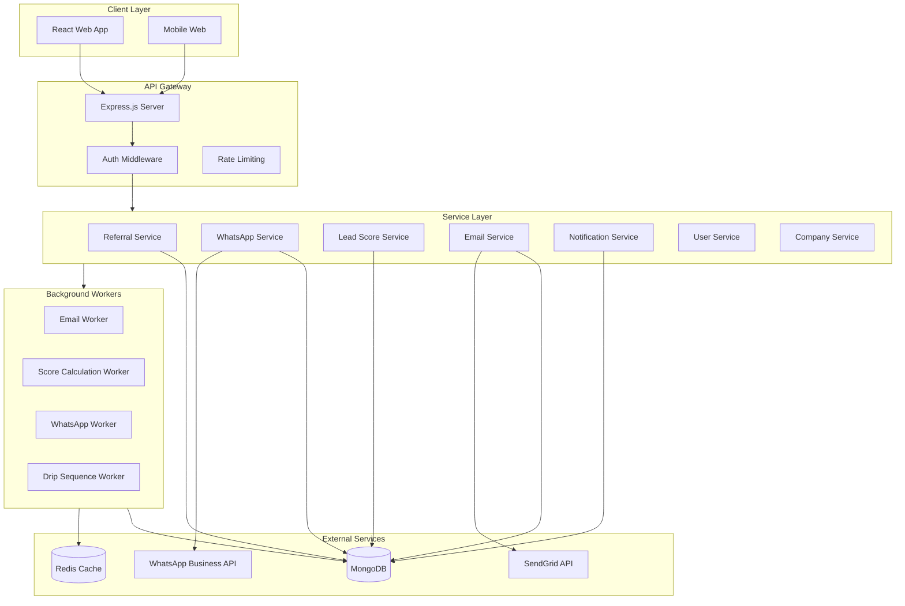
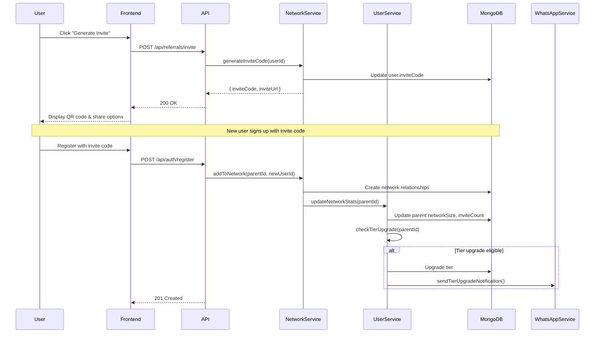
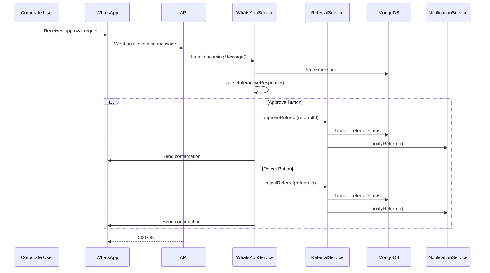
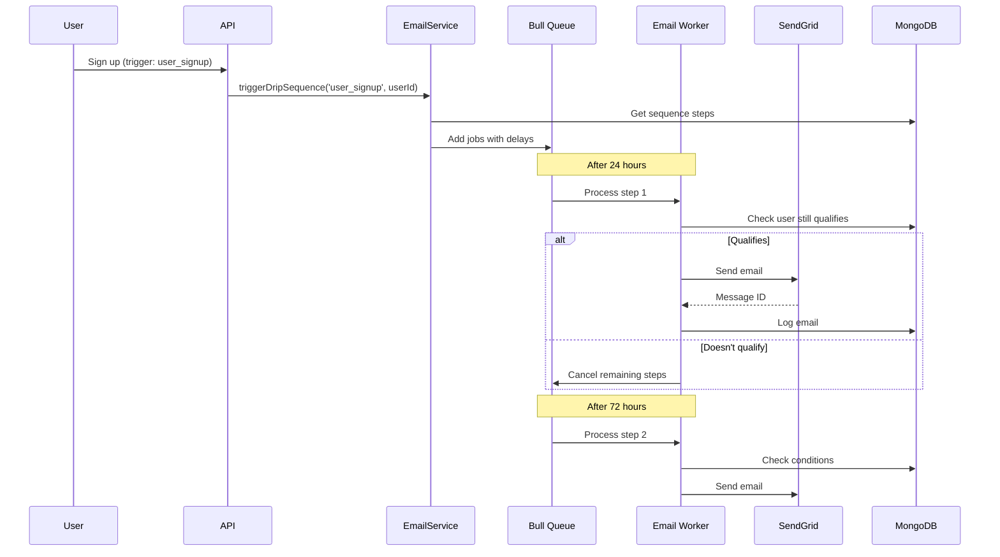

# Phase 1 Technical Architecture & Implementation Plan

## Executive Summary

This document provides a comprehensive technical architecture and implementation plan for Phase 1 of the TRM revenue-generating platform. The design builds upon the existing solid foundation (MERN stack with TypeScript) and introduces four major feature areas focused on revenue generation and market penetration in Myanmar.

---

## 1. Database Schema Extensions

### 1.1 Viral Referral System Schema

#### Extended User Model (server/models/User.js)

```javascript
// Add to ReferrerProfileSchema
const ReferrerProfileSchema = new Schema({
  // ... existing fields ...
  
  // Viral tracking fields
  parentReferrerId: {
    type: Schema.Types.ObjectId,
    ref: 'User',
    index: true,
  },
  inviteCode: {
    type: String,
    unique: true,
    sparse: true,
    trim: true,
    uppercase: true,
  },
  inviteCount: {
    type: Number,
    default: 0,
    min: 0,
  },
  networkSize: {
    type: Number,
    default: 0, // Total downline size (direct + indirect)
    min: 0,
  },
  directReferrals: {
    type: Number,
    default: 0,
    min: 0,
  },
  tierLevel: {
    type: String,
    enum: ['bronze', 'silver', 'gold', 'platinum'],
    default: 'bronze',
  },
  tierProgress: {
    type: Number,
    default: 0, // Percentage to next tier
    min: 0,
    max: 100,
  },
  tierUpgradedAt: {
    type: Date,
  },
  networkEarnings: {
    type: Number,
    default: 0, // Earnings from downline activity
    min: 0,
  },
  
  // WhatsApp integration
  whatsappNumber: {
    type: String,
    trim: true,
  },
  whatsappOptIn: {
    type: Boolean,
    default: false,
  },
  whatsappVerifiedAt: {
    type: Date,
  },
  
  // Email marketing preferences
  emailPreferences: {
    marketing: { type: Boolean, default: true },
    jobAlerts: { type: Boolean, default: true },
    referralUpdates: { type: Boolean, default: true },
    newsletter: { type: Boolean, default: true },
  },
  
  // Lead scoring
  leadScore: {
    type: Number,
    default: 0,
    min: 0,
    max: 100,
  },
  scoreFactors: {
    profileCompleteness: { type: Number, default: 0 },
    activityScore: { type: Number, default: 0 },
    referralQuality: { type: Number, default: 0 },
    engagementScore: { type: Number, default: 0 },
  },
}, { _id: false });
```

#### New Collection: ReferralNetwork

```javascript
// server/models/ReferralNetwork.js
const NetworkRelationshipSchema = new Schema({
  ancestorId: {
    type: Schema.Types.ObjectId,
    ref: 'User',
    required: true,
    index: true,
  },
  descendantId: {
    type: Schema.Types.ObjectId,
    ref: 'User',
    required: true,
    index: true,
  },
  depth: {
    type: Number,
    required: true, // 1 = direct, 2 = grandchild, etc.
    min: 1,
  },
  createdAt: {
    type: Date,
    default: Date.now,
  },
});

// Compound index for efficient tree queries
NetworkRelationshipSchema.index({ ancestorId: 1, depth: 1 });
NetworkRelationshipSchema.index({ descendantId: 1 });
```

#### New Collection: TierBenefits

```javascript
// server/models/TierBenefits.js
const TierBenefitsSchema = new Schema({
  tier: {
    type: String,
    enum: ['bronze', 'silver', 'gold', 'platinum'],
    required: true,
    unique: true,
  },
  name: {
    type: String,
    required: true,
  },
  requirements: {
    minReferrals: { type: Number, required: true },
    minNetworkSize: { type: Number, required: true },
    minEarnings: { type: Number, required: true },
  },
  benefits: {
    commissionMultiplier: { type: Number, default: 1.0 }, // 1.0 = 100%
    bonusPercentage: { type: Number, default: 0 }, // Additional % on referrals
    priorityPayouts: { type: Boolean, default: false },
    dedicatedSupport: { type: Boolean, default: false },
    earlyAccess: { type: Boolean, default: false },
    customReferralCode: { type: Boolean, default: false },
  },
  badgeUrl: String,
  color: String,
  isActive: {
    type: Boolean,
    default: true,
  },
}, { timestamps: true });
```

### 1.2 WhatsApp Integration Schema

#### New Collection: WhatsAppSession

```javascript
// server/models/WhatsAppSession.js
const WhatsAppSessionSchema = new Schema({
  userId: {
    type: Schema.Types.ObjectId,
    ref: 'User',
    required: true,
    index: true,
  },
  companyId: {
    type: Schema.Types.ObjectId,
    ref: 'Company',
    index: true,
  },
  phoneNumber: {
    type: String,
    required: true,
    trim: true,
  },
  waId: {
    type: String, // WhatsApp Business API ID
    index: true,
  },
  sessionStatus: {
    type: String,
    enum: ['pending', 'active', 'paused', 'expired'],
    default: 'pending',
  },
  optInStatus: {
    type: String,
    enum: ['pending', 'confirmed', 'declined', 'revoked'],
    default: 'pending',
  },
  optInAt: {
    type: Date,
  },
  optOutAt: {
    type: Date,
  },
  lastMessageAt: {
    type: Date,
  },
  messageCount: {
    type: Number,
    default: 0,
  },
  templatesReceived: [{
    type: String,
  }],
  metadata: {
    type: Schema.Types.Mixed,
    default: {},
  },
}, { timestamps: true });

WhatsAppSessionSchema.index({ phoneNumber: 1, userId: 1 });
```

#### New Collection: WhatsAppMessage

```javascript
// server/models/WhatsAppMessage.js
const WhatsAppMessageSchema = new Schema({
  sessionId: {
    type: Schema.Types.ObjectId,
    ref: 'WhatsAppSession',
    required: true,
    index: true,
  },
  userId: {
    type: Schema.Types.ObjectId,
    ref: 'User',
    required: true,
    index: true,
  },
  direction: {
    type: String,
    enum: ['inbound', 'outbound'],
    required: true,
  },
  messageType: {
    type: String,
    enum: ['text', 'template', 'image', 'document', 'interactive', 'button'],
    required: true,
  },
  content: {
    body: String,
    templateName: String,
    templateLanguage: String,
    templateParams: [Schema.Types.Mixed],
    mediaUrl: String,
    caption: String,
  },
  waMessageId: {
    type: String, // WhatsApp message ID
    index: true,
  },
  status: {
    type: String,
    enum: ['pending', 'sent', 'delivered', 'read', 'failed'],
    default: 'pending',
  },
  statusHistory: [{
    status: String,
    timestamp: Date,
  }],
  context: {
    referralId: Schema.Types.ObjectId,
    jobId: Schema.Types.ObjectId,
    companyId: Schema.Types.ObjectId,
    actionType: String, // 'approve', 'reject', 'view', etc.
  },
  interactiveResponse: {
    buttonReply: {
      id: String,
      title: String,
    },
    listReply: {
      id: String,
      title: String,
    },
  },
  error: {
    code: String,
    message: String,
  },
}, { timestamps: true });

WhatsAppMessageSchema.index({ createdAt: -1 });
WhatsAppMessageSchema.index({ 'context.referralId': 1 });
```

#### Extended Notification Model

```javascript
// Add to NotificationSchema
const NotificationSchema = new Schema({
  // ... existing fields ...
  
  // WhatsApp delivery tracking
  deliveryStatus: {
    // ... existing fields ...
    whatsapp: {
      sent: { type: Boolean, default: false },
      sentAt: { type: Date },
      delivered: { type: Boolean, default: false },
      deliveredAt: { type: Date },
      read: { type: Boolean, default: false },
      readAt: { type: Date },
      messageId: { type: String },
    },
  },
  
  // Add WHATSAPP to channels enum
  channels: [{
    type: String,
    enum: ['in_app', 'email', 'sms', 'push', 'whatsapp'],
  }],
});
```

### 1.3 Lead Scoring Schema

#### New Collection: LeadScore

```javascript
// server/models/LeadScore.js
const LeadScoreSchema = new Schema({
  entityType: {
    type: String,
    enum: ['user', 'company'],
    required: true,
    index: true,
  },
  entityId: {
    type: Schema.Types.ObjectId,
    required: true,
    index: true,
  },
  totalScore: {
    type: Number,
    required: true,
    min: 0,
    max: 100,
  },
  factors: {
    // For users (referrers/job seekers)
    profileCompleteness: { type: Number, default: 0 },
    experienceMatch: { type: Number, default: 0 },
    skillsMatch: { type: Number, default: 0 },
    referrerQuality: { type: Number, default: 0 },
    activityScore: { type: Number, default: 0 },
    engagementScore: { type: Number, default: 0 },
    
    // For companies
    postingFrequency: { type: Number, default: 0 },
    bonusSize: { type: Number, default: 0 },
    responseTime: { type: Number, default: 0 },
    payoutHistory: { type: Number, default: 0 },
    subscriptionTier: { type: Number, default: 0 },
  },
  lastCalculatedAt: {
    type: Date,
    default: Date.now,
  },
  scoreHistory: [{
    score: Number,
    calculatedAt: Date,
    reason: String,
  }],
  priority: {
    type: String,
    enum: ['low', 'medium', 'high', 'critical'],
    default: 'medium',
  },
  alerts: [{
    type: String,
    triggeredAt: Date,
    acknowledgedAt: Date,
  }],
}, {
  timestamps: true,
});

LeadScoreSchema.index({ entityType: 1, totalScore: -1 });
LeadScoreSchema.index({ priority: 1, totalScore: -1 });
```

#### Extended Company Model

```javascript
// Add to CompanySchema
const CompanySchema = new Schema({
  // ... existing fields ...
  
  // Lead scoring fields
  leadScore: {
    type: Number,
    default: 0,
    min: 0,
    max: 100,
  },
  scoreFactors: {
    postingFrequency: { type: Number, default: 0 },
    responseTime: { type: Number, default: 0 },
    payoutReliability: { type: Number, default: 0 },
    engagementScore: { type: Number, default: 0 },
  },
  
  // Response tracking
  averageResponseTime: {
    type: Number, // in hours
    default: 0,
  },
  lastResponseAt: {
    type: Date,
  },
  
  // High-value alerts
  highValueAlerts: [{
    type: String,
    triggeredAt: Date,
    acknowledgedAt: Date,
  }],
});
```

### 1.4 Email Marketing Schema

#### New Collection: EmailCampaign

```javascript
// server/models/EmailCampaign.js
const EmailCampaignSchema = new Schema({
  name: {
    type: String,
    required: true,
    trim: true,
  },
  type: {
    type: String,
    enum: ['one_time', 'drip_sequence', 'triggered', 'newsletter'],
    required: true,
  },
  status: {
    type: String,
    enum: ['draft', 'scheduled', 'active', 'paused', 'completed', 'cancelled'],
    default: 'draft',
  },
  
  // Audience targeting
  audience: {
    segmentIds: [{
      type: Schema.Types.ObjectId,
      ref: 'UserSegment',
    }],
    filters: {
      roles: [String],
      tierLevels: [String],
      minLeadScore: Number,
      maxLeadScore: Number,
      joinedAfter: Date,
      joinedBefore: Date,
      hasReferrals: Boolean,
      hasEarnings: Boolean,
      location: String,
    },
    excludeUserIds: [{
      type: Schema.Types.ObjectId,
      ref: 'User',
    }],
  },
  
  // For drip sequences
  sequence: {
    trigger: {
      type: String,
      enum: ['user_signup', 'first_referral', 'referral_hired', 'inactivity', 'manual'],
    },
    emails: [{
      order: Number,
      templateId: {
        type: Schema.Types.ObjectId,
        ref: 'EmailTemplate',
      },
      delayHours: Number, // Hours after trigger
      subject: String,
      preheader: String,
      condition: String, // e.g., "referralCount > 0"
    }],
  },
  
  // Scheduling
  schedule: {
    sendAt: Date,
    timezone: {
      type: String,
      default: 'Asia/Yangon',
    },
    batchSize: {
      type: Number,
      default: 100,
    },
    batchInterval: {
      type: Number,
      default: 60, // seconds between batches
    },
  },
  
  // Statistics
  stats: {
    totalRecipients: { type: Number, default: 0 },
    sent: { type: Number, default: 0 },
    delivered: { type: Number, default: 0 },
    opened: { type: Number, default: 0 },
    clicked: { type: Number, default: 0 },
    bounced: { type: Number, default: 0 },
    unsubscribed: { type: Number, default: 0 },
    complained: { type: Number, default: 0 },
  },
  
  createdBy: {
    type: Schema.Types.ObjectId,
    ref: 'User',
  },
}, { timestamps: true });
```

#### New Collection: EmailTemplate

```javascript
// server/models/EmailTemplate.js
const EmailTemplateSchema = new Schema({
  name: {
    type: String,
    required: true,
    trim: true,
  },
  category: {
    type: String,
    enum: ['transactional', 'marketing', 'drip', 'notification'],
    required: true,
  },
  subject: {
    type: String,
    required: true,
  },
  preheader: {
    type: String,
  },
  
  // Content versions
  content: {
    html: {
      type: String,
      required: true,
    },
    text: {
      type: String,
      required: true,
    },
    mjml: String, // For MJML-based templates
  },
  
  // Variables available in template
  variables: [{
    name: String,
    description: String,
    defaultValue: String,
    required: Boolean,
  }],
  
  // Design
  design: {
    layout: String,
    primaryColor: String,
    logoUrl: String,
    headerImage: String,
    footerText: String,
  },
  
  // SendGrid template ID (if synced)
  sendgridTemplateId: String,
  
  // Status
  status: {
    type: String,
    enum: ['draft', 'active', 'archived'],
    default: 'draft',
  },
  
  // Usage tracking
  usage: {
    timesUsed: { type: Number, default: 0 },
    lastUsedAt: Date,
  },
  
  createdBy: {
    type: Schema.Types.ObjectId,
    ref: 'User',
  },
}, { timestamps: true });
```

#### New Collection: UserSegment

```javascript
// server/models/UserSegment.js
const UserSegmentSchema = new Schema({
  name: {
    type: String,
    required: true,
    trim: true,
  },
  description: {
    type: String,
  },
  
  // Filter criteria
  criteria: {
    roles: [{
      type: String,
      enum: ['referrer', 'job_seeker', 'corporate_admin', 'corporate_recruiter'],
    }],
    tierLevels: [String],
    minReferrals: Number,
    maxReferrals: Number,
    minEarnings: Number,
    maxEarnings: Number,
    minLeadScore: Number,
    maxLeadScore: Number,
    joinedAfter: Date,
    joinedBefore: Date,
    lastActiveAfter: Date,
    lastActiveBefore: Date,
    hasKyc: Boolean,
    hasWhatsapp: Boolean,
    location: String,
    tags: [String],
  },
  
  // Dynamic segment (auto-updates)
  isDynamic: {
    type: Boolean,
    default: true,
  },
  
  // Cached user count
  userCount: {
    type: Number,
    default: 0,
  },
  lastCalculatedAt: {
    type: Date,
  },
  
  createdBy: {
    type: Schema.Types.ObjectId,
    ref: 'User',
  },
}, { timestamps: true });
```

#### New Collection: EmailLog

```javascript
// server/models/EmailLog.js
const EmailLogSchema = new Schema({
  campaignId: {
    type: Schema.Types.ObjectId,
    ref: 'EmailCampaign',
    index: true,
  },
  templateId: {
    type: Schema.Types.ObjectId,
    ref: 'EmailTemplate',
    index: true,
  },
  userId: {
    type: Schema.Types.ObjectId,
    ref: 'User',
    required: true,
    index: true,
  },
  
  // Recipient info (snapshot)
  recipient: {
    email: String,
    name: String,
  },
  
  // SendGrid tracking
  sendgridMessageId: String,
  
  // Status
  status: {
    type: String,
    enum: ['queued', 'sent', 'delivered', 'opened', 'clicked', 'bounced', 'dropped', 'deferred', 'processed', 'spam_report', 'unsubscribe', 'group_unsubscribe', 'group_resubscribe'],
    default: 'queued',
  },
  
  // Timeline
  events: [{
    event: String,
    timestamp: Date,
    ip: String,
    userAgent: String,
    url: String, // For clicks
    reason: String, // For bounces
  }],
  
  // Content
  subject: String,
  content: {
    html: String,
    text: String,
  },
  
  // Metadata
  metadata: {
    type: Schema.Types.Mixed,
    default: {},
  },
}, { timestamps: true });

EmailLogSchema.index({ userId: 1, createdAt: -1 });
EmailLogSchema.index({ status: 1 });
```

---

## 2. API Endpoint Specifications

### 2.1 Viral Referral System Endpoints

```
GET    /api/referrals/network
       - Get user's referral network (downline)
       - Query: depth (1-5), page, limit
       - Response: { users: [], total: number, depth: number }

GET    /api/referrals/network/stats
       - Get network statistics
       - Response: { 
           directReferrals: number,
           networkSize: number,
           networkEarnings: number,
           byTier: {},
           byLevel: {}
         }

POST   /api/referrals/invite
       - Generate invite link/code
       - Body: { campaignId?, source?, medium? }
       - Response: { inviteCode, inviteUrl, qrCode }

GET    /api/referrals/tiers
       - Get all tier benefits
       - Response: { tiers: [] }

GET    /api/referrals/tiers/my-progress
       - Get current user's tier progress
       - Response: { 
           currentTier: string,
           nextTier: string,
           progress: number,
           requirements: {},
           benefits: {}
         }

GET    /api/referrals/leaderboard
       - Get referrer leaderboard
       - Query: period (weekly/monthly/all), type (earnings/referrals/network)
       - Response: { leaderboard: [], userRank: number }
```

### 2.2 WhatsApp Integration Endpoints

```
POST   /api/whatsapp/webhook
       - Incoming webhook from WhatsApp Business API
       - Body: { object, entry: [] }
       - Response: 200 OK

POST   /api/whatsapp/opt-in
       - User opts in to WhatsApp messages
       - Body: { phoneNumber, userId }
       - Response: { success, verificationCode }

POST   /api/whatsapp/verify
       - Verify WhatsApp number
       - Body: { phoneNumber, code }
       - Response: { success, session }

POST   /api/whatsapp/opt-out
       - User opts out
       - Body: { phoneNumber }
       - Response: { success }

POST   /api/whatsapp/send
       - Send WhatsApp message (admin only)
       - Body: { userId, templateName, params, context }
       - Response: { messageId, status }

GET    /api/whatsapp/sessions/:userId
       - Get user's WhatsApp session
       - Response: { session }

GET    /api/whatsapp/messages
       - Get message history
       - Query: userId, limit, offset
       - Response: { messages: [] }

POST   /api/whatsapp/interactive
       - Handle interactive message response
       - Body: { messageId, buttonId, userId }
       - Response: { success, action }
```

### 2.3 Lead Scoring Endpoints

```
GET    /api/leads/scores
       - Get lead scores (admin/sales)
       - Query: type (user/company), priority, minScore, maxScore, page, limit
       - Response: { scores: [], pagination: {} }

GET    /api/leads/scores/:entityType/:entityId
       - Get specific entity score
       - Response: { score: {}, factors: {} }

POST   /api/leads/scores/recalculate
       - Trigger recalculation (admin)
       - Body: { entityType, entityIds? }
       - Response: { jobId, status }

GET    /api/leads/dashboard
       - Get lead scoring dashboard data
       - Response: {
           summary: {},
           highPriority: [],
           trends: [],
           byTier: [],
           alerts: []
         }

POST   /api/leads/alerts/acknowledge
       - Acknowledge high-value alert
       - Body: { alertId }
       - Response: { success }

GET    /api/leads/companies/priority
       - Get prioritized company list for sales
       - Query: limit, minScore
       - Response: { companies: [] }
```

### 2.4 Email Marketing Endpoints

```
GET    /api/campaigns
       - List all campaigns
       - Query: status, type, page, limit
       - Response: { campaigns: [], pagination: {} }

POST   /api/campaigns
       - Create new campaign
       - Body: { name, type, audience, sequence?, schedule? }
       - Response: { campaign }

GET    /api/campaigns/:id
       - Get campaign details
       - Response: { campaign, stats: {} }

PUT    /api/campaigns/:id
       - Update campaign
       - Body: { name, audience, sequence?, schedule? }
       - Response: { campaign }

DELETE /api/campaigns/:id
       - Delete campaign (draft only)
       - Response: { success }

POST   /api/campaigns/:id/launch
       - Launch campaign
       - Response: { success, jobId }

POST   /api/campaigns/:id/pause
       - Pause active campaign
       - Response: { success }

POST   /api/campaigns/:id/duplicate
       - Duplicate campaign
       - Response: { campaign }

GET    /api/templates
       - List email templates
       - Query: category, status
       - Response: { templates: [] }

POST   /api/templates
       - Create template
       - Body: { name, category, subject, content: {html, text} }
       - Response: { template }

PUT    /api/templates/:id
       - Update template
       - Response: { template }

POST   /api/templates/:id/preview
       - Preview template with variables
       - Body: { variables: {} }
       - Response: { html, text }

GET    /api/segments
       - List user segments
       - Response: { segments: [] }

POST   /api/segments
       - Create segment
       - Body: { name, criteria, isDynamic }
       - Response: { segment, userCount }

POST   /api/segments/:id/preview
       - Preview segment users
       - Response: { users: [], count }

GET    /api/email-logs
       - Get email sending logs
       - Query: campaignId, userId, status, dateFrom, dateTo
       - Response: { logs: [], stats: {} }

POST   /api/email/send-test
       - Send test email
       - Body: { templateId, to, variables }
       - Response: { success }
```

---

## 3. Service Architecture

### 3.1 System Architecture Diagram



### 3.2 New Services

#### ReferralNetworkService

```typescript
// server/services/referralNetworkService.js

class ReferralNetworkService {
  // Network building
  async addToNetwork(parentId: ObjectId, childId: ObjectId): Promise<void>
  async removeFromNetwork(userId: ObjectId): Promise<void>
  async getDownline(userId: ObjectId, depth: number): Promise<User[]>
  async getUpline(userId: ObjectId): Promise<User[]>
  
  // Network statistics
  async calculateNetworkSize(userId: ObjectId): Promise<number>
  async getNetworkEarnings(userId: ObjectId): Promise<number>
  async getTierProgress(userId: ObjectId): Promise<TierProgress>
  
  // Tier management
  async checkTierUpgrade(userId: ObjectId): Promise<boolean>
  async upgradeTier(userId: ObjectId, newTier: string): Promise<void>
  async getTierBenefits(tier: string): Promise<TierBenefits>
  
  // Invite management
  async generateInviteCode(userId: ObjectId): Promise<string>
  async validateInviteCode(code: string): Promise<boolean>
  async trackInviteConversion(code: string, newUserId: ObjectId): Promise<void>
}
```

#### WhatsAppService

```typescript
// server/services/whatsappService.js

class WhatsAppService {
  // Session management
  async createSession(userId: ObjectId, phoneNumber: string): Promise<Session>
  async verifySession(sessionId: ObjectId, code: string): Promise<boolean>
  async optOut(userId: ObjectId): Promise<void>
  
  // Message sending
  async sendTemplateMessage(
    userId: ObjectId, 
    templateName: string, 
    params: object,
    context?: object
  ): Promise<Message>
  
  async sendTextMessage(userId: ObjectId, text: string): Promise<Message>
  
  async sendInteractiveMessage(
    userId: ObjectId,
    header: string,
    body: string,
    buttons: Button[],
    context?: object
  ): Promise<Message>
  
  // Webhook handling
  async handleIncomingMessage(webhookData: object): Promise<void>
  async handleStatusUpdate(webhookData: object): Promise<void>
  
  // Template management
  async syncTemplates(): Promise<void>
  async getTemplateStatus(templateName: string): Promise<string>
  
  // Business actions
  async sendReferralActionPrompt(
    recruiterId: ObjectId,
    referralId: ObjectId,
    action: 'review' | 'approve' | 'reject'
  ): Promise<void>
}
```

#### LeadScoreService

```typescript
// server/services/leadScoreService.js

class LeadScoreService {
  // Score calculation
  async calculateUserScore(userId: ObjectId): Promise<number>
  async calculateCompanyScore(companyId: ObjectId): Promise<number>
  
  // Factor calculation
  calculateProfileCompleteness(user: User): number
  calculateActivityScore(user: User): number
  calculateReferralQuality(user: User): number
  calculateCompanyPostingFrequency(company: Company): number
  calculateCompanyResponseTime(company: Company): number
  
  // Batch operations
  async recalculateAllScores(entityType: string): Promise<Job>
  async updateScoresBatch(entityIds: ObjectId[]): Promise<void>
  
  // Alerts
  async checkHighValueAlerts(entityType: string, entityId: ObjectId): Promise<Alert[]>
  async triggerAlert(alert: Alert): Promise<void>
  
  // Dashboard data
  async getDashboardSummary(): Promise<DashboardSummary>
  async getPriorityCompanies(limit: number): Promise<Company[]>
}
```

#### EmailMarketingService

```typescript
// server/services/emailMarketingService.js

class EmailMarketingService {
  // Campaign management
  async createCampaign(data: CampaignData): Promise<Campaign>
  async launchCampaign(campaignId: ObjectId): Promise<void>
  async pauseCampaign(campaignId: ObjectId): Promise<void>
  
  // Audience building
  async buildAudience(criteria: AudienceCriteria): Promise<User[]>
  async calculateSegmentSize(segmentId: ObjectId): Promise<number>
  
  // Template management
  async createTemplate(data: TemplateData): Promise<Template>
  async renderTemplate(templateId: ObjectId, variables: object): Promise<RenderedTemplate>
  async syncToSendGrid(templateId: ObjectId): Promise<string>
  
  // Sending
  async sendCampaignEmail(campaignId: ObjectId, userId: ObjectId): Promise<void>
  async sendTransactionalEmail(templateName: string, userId: ObjectId, data: object): Promise<void>
  async sendTestEmail(templateId: ObjectId, to: string, variables: object): Promise<void>
  
  // Drip sequences
  async triggerDripSequence(trigger: string, userId: ObjectId): Promise<void>
  async processDripStep(sequenceId: ObjectId, stepIndex: number): Promise<void>
  
  // Analytics
  async getCampaignStats(campaignId: ObjectId): Promise<CampaignStats>
  async getEmailLogs(campaignId: ObjectId): Promise<EmailLog[]>
}
```

---

## 4. Frontend Component Structure

### 4.1 New Sections

```
src/sections/
├── NetworkDashboard.tsx          # Viral network visualization
├── InviteGenerator.tsx           # Invite link/code generation
├── TierProgress.tsx              # Tier upgrade progress
├── Leaderboard.tsx               # Referrer leaderboard
├── WhatsAppSettings.tsx          # WhatsApp opt-in/settings
├── LeadScoreDashboard.tsx        # Lead scoring admin dashboard
├── CompanyPriorityList.tsx       # Prioritized company list
├── CampaignManager.tsx           # Email campaign management
├── TemplateEditor.tsx            # Email template editor
├── SegmentBuilder.tsx            # User segment builder
└── DripSequenceBuilder.tsx       # Drip sequence configuration
```

### 4.2 New Components

```
src/components/
├── network/
│   ├── NetworkTree.tsx           # Hierarchical network display
│   ├── NetworkStats.tsx          # Network statistics cards
│   ├── TierBadge.tsx             # Tier level badge
│   ├── InviteCard.tsx            # Shareable invite card
│   └── ProgressRing.tsx          # Circular progress indicator
│
├── whatsapp/
│   ├── WhatsAppConnect.tsx       # WhatsApp connection flow
│   ├── WhatsAppOptIn.tsx         # Opt-in checkbox/form
│   ├── MessagePreview.tsx        # Message preview modal
│   └── QRCodeDisplay.tsx         # WhatsApp QR code
│
├── leads/
│   ├── LeadScoreCard.tsx         # Individual lead score display
│   ├── ScoreFactorBar.tsx        # Score factor breakdown
│   ├── PriorityBadge.tsx         # Priority level badge
│   ├── AlertList.tsx             # High-value alerts list
│   └── TrendChart.tsx            # Score trend visualization
│
├── email/
│   ├── CampaignCard.tsx          # Campaign list item
│   ├── TemplatePreview.tsx       # Template preview pane
│   ├── SegmentFilter.tsx         # Segment filter builder
│   ├── DripTimeline.tsx          # Drip sequence timeline
│   ├── EmailStats.tsx            # Campaign statistics
│   └── RichTextEditor.tsx        # Email content editor
│
└── common/
    ├── DataTable.tsx             # Reusable data table
    ├── FilterPanel.tsx           # Advanced filtering
    ├── DateRangePicker.tsx       # Date range selection
    └── ExportButton.tsx          # Data export
```

### 4.3 New Hooks

```
src/hooks/
├── useNetwork.ts                 # Network data fetching
├── useInvite.ts                  # Invite code management
├── useTier.ts                    # Tier status & progress
├── useWhatsApp.ts                # WhatsApp session management
├── useLeadScore.ts               # Lead score data
├── useCampaigns.ts               # Campaign CRUD operations
├── useTemplates.ts               # Template management
├── useSegments.ts                # Segment operations
└── useDripSequence.ts            # Drip sequence management
```

---

## 5. Integration Points

### 5.1 WhatsApp Business API Integration

**Provider**: WhatsApp Business API (via Meta Business Partner)

**Configuration**:
```javascript
// server/config/whatsapp.js
export const whatsappConfig = {
  apiVersion: 'v18.0',
  baseUrl: 'https://graph.facebook.com/v18.0',
  phoneNumberId: process.env.WHATSAPP_PHONE_NUMBER_ID,
  businessAccountId: process.env.WHATSAPP_BUSINESS_ACCOUNT_ID,
  accessToken: process.env.WHATSAPP_ACCESS_TOKEN,
  webhookVerifyToken: process.env.WHATSAPP_WEBHOOK_VERIFY_TOKEN,
  
  // Template names (must be pre-approved)
  templates: {
    WELCOME: 'welcome_message',
    REFERRAL_SUBMITTED: 'referral_submitted',
    REFERRAL_STATUS_UPDATE: 'referral_status_update',
    REFERRAL_HIRED: 'referral_hired',
    PAYOUT_PROCESSED: 'payout_processed',
    JOB_ALERT: 'job_alert',
    REMINDER_24HR: 'reminder_24hr',
    REMINDER_72HR: 'reminder_72hr',
    APPROVAL_REQUEST: 'approval_request',
  },
};
```

**Message Templates Required**:

1. **welcome_message** - Welcome new users
2. **referral_submitted** - Confirm referral submission
3. **referral_status_update** - Status change notification
4. **referral_hired** - Successful hire with bonus info
5. **payout_processed** - Payout completion
6. **job_alert** - New matching jobs
7. **reminder_24hr** - 24-hour follow-up
8. **reminder_72hr** - 72-hour follow-up
9. **approval_request** - Two-way approval request with buttons

**Webhook Events**:
- `messages` - Incoming messages
- `message_status` - Delivery status updates
- `template_status_update` - Template approval status

### 5.2 SendGrid Integration

**Configuration**:
```javascript
// server/config/sendgrid.js
export const sendgridConfig = {
  apiKey: process.env.SENDGRID_API_KEY,
  fromEmail: process.env.SENDGRID_FROM_EMAIL,
  fromName: process.env.SENDGRID_FROM_NAME || 'TRM Platform',
  
  // Webhook settings
  webhookSigningKey: process.env.SENDGRID_WEBHOOK_SIGNING_KEY,
  
  // IP warm-up settings
  ipWarmupEnabled: true,
  dailySendLimit: 100, // Start low, increase gradually
  
  // Template settings
  dynamicTemplatePrefix: 'trm_',
  
  // Suppression groups
  unsubscribeGroupId: process.env.SENDGRID_UNSUBSCRIBE_GROUP_ID,
};
```

**Event Webhooks**:
- `delivered` - Email delivered
- `open` - Email opened
- `click` - Link clicked
- `bounce` - Email bounced
- `dropped` - Email dropped
- `spam_report` - Marked as spam
- `unsubscribe` - Unsubscribed

### 5.3 MongoDB Schema Migrations

**Migration Strategy**:

```javascript
// migrations/001_add_viral_fields.js
export async function up() {
  // Add viral fields to existing users
  await db.collection('users').updateMany(
    { role: 'referrer' },
    {
      $set: {
        'referrerProfile.inviteCount': 0,
        'referrerProfile.networkSize': 0,
        'referrerProfile.directReferrals': 0,
        'referrerProfile.tierLevel': 'bronze',
        'referrerProfile.tierProgress': 0,
        'referrerProfile.networkEarnings': 0,
        'referrerProfile.whatsappOptIn': false,
        'referrerProfile.leadScore': 0,
        'referrerProfile.emailPreferences': {
          marketing: true,
          jobAlerts: true,
          referralUpdates: true,
          newsletter: true,
        },
      },
    }
  );
  
  // Generate invite codes for existing referrers
  const referrers = await db.collection('users').find({ role: 'referrer' }).toArray();
  for (const referrer of referrers) {
    const inviteCode = generateInviteCode();
    await db.collection('users').updateOne(
      { _id: referrer._id },
      { $set: { 'referrerProfile.inviteCode': inviteCode } }
    );
  }
}
```

---

## 6. Implementation Sequence

### Phase 1A: Foundation (Week 1-2)

**Dependencies**: None

```
[ ] 1.1 Database schema migrations
    [ ] Create ReferralNetwork collection
    [ ] Create TierBenefits collection
    [ ] Extend User model with viral fields
    [ ] Run migration scripts

[ ] 1.2 Core service setup
    [ ] Create ReferralNetworkService
    [ ] Create base WhatsAppService structure
    [ ] Create LeadScoreService skeleton
    [ ] Create EmailMarketingService skeleton

[ ] 1.3 API route setup
    [ ] Create /api/referrals/network routes
    [ ] Create /api/whatsapp routes (skeleton)
    [ ] Create /api/leads routes (skeleton)
    [ ] Create /api/campaigns routes (skeleton)
```

### Phase 1B: Viral Referral System (Week 2-3)

**Dependencies**: 1.1, 1.2, 1.3

```
[ ] 2.1 Invite system
    [ ] Implement invite code generation
    [ ] Create invite link tracking
    [ ] Build QR code generation
    [ ] Add invite conversion tracking

[ ] 2.2 Network visualization
    [ ] Build NetworkTree component
    [ ] Create network statistics API
    [ ] Implement downline querying
    [ ] Add network earnings calculation

[ ] 2.3 Tier system
    [ ] Create tier configuration
    [ ] Implement tier upgrade logic
    [ ] Build tier progress UI
    [ ] Add tier upgrade notifications

[ ] 2.4 Frontend integration
    [ ] Create NetworkDashboard section
    [ ] Build InviteGenerator component
    [ ] Add tier badges to profile
    [ ] Implement leaderboard
```

### Phase 1C: WhatsApp Integration (Week 3-4)

**Dependencies**: 1.1, 1.2

```
[ ] 3.1 WhatsApp Business API setup
    [ ] Configure WhatsApp Business account
    [ ] Set up webhook endpoint
    [ ] Create message templates (submit for approval)
    [ ] Implement webhook verification

[ ] 3.2 Session management
    [ ] Build WhatsAppSession model
    [ ] Implement opt-in/opt-out flow
    [ ] Create phone number verification
    [ ] Add session persistence

[ ] 3.3 Message handling
    [ ] Implement template message sending
    [ ] Build incoming message handler
    [ ] Create two-way messaging flow
    [ ] Add message status tracking

[ ] 3.4 Business features
    [ ] Implement approval request messages
    [ ] Build job alert notifications
    [ ] Create reminder sequences
    [ ] Add WhatsApp preferences UI
```

### Phase 1D: Lead Scoring (Week 4-5)

**Dependencies**: 1.1, 1.2

```
[ ] 4.1 Scoring algorithm
    [ ] Implement user scoring factors
    [ ] Implement company scoring factors
    [ ] Create score calculation engine
    [ ] Add score history tracking

[ ] 4.2 Background processing
    [ ] Set up score calculation worker
    [ ] Implement batch recalculation
    [ ] Add scheduled score updates
    [ ] Create score change triggers

[ ] 4.3 Alert system
    [ ] Build high-value alert detection
    [ ] Create alert notification system
    [ ] Implement alert acknowledgment
    [ ] Add alert history

[ ] 4.4 Dashboard
    [ ] Create LeadScoreDashboard section
    [ ] Build priority company list
    [ ] Implement score trend charts
    [ ] Add export functionality
```

### Phase 1E: Email Marketing (Week 5-6)

**Dependencies**: 1.1, 1.2

```
[ ] 5.1 SendGrid integration
    [ ] Configure SendGrid client
    [ ] Set up webhook handling
    [ ] Implement email sending
    [ ] Add delivery tracking

[ ] 5.2 Template system
    [ ] Create EmailTemplate model
    [ ] Build template editor UI
    [ ] Implement template rendering
    [ ] Add template versioning

[ ] 5.3 Campaign management
    [ ] Build campaign creation flow
    [ ] Implement audience segmentation
    [ ] Create batch sending system
    [ ] Add campaign analytics

[ ] 5.4 Drip sequences
    [ ] Implement drip sequence engine
    [ ] Create trigger system
    [ ] Build sequence builder UI
    [ ] Add delay/condition logic

[ ] 5.5 Frontend
    [ ] Create CampaignManager section
    [ ] Build TemplateEditor component
    [ ] Implement SegmentBuilder
    [ ] Add DripSequenceBuilder
```

### Phase 1F: Integration & Polish (Week 6-7)

**Dependencies**: All above

```
[ ] 6.1 Cross-feature integration
    [ ] Link tier upgrades to email notifications
    [ ] Add WhatsApp to drip sequences
    [ ] Integrate lead scores with campaigns
    [ ] Connect network to lead scoring

[ ] 6.2 Testing
    [ ] Unit tests for services
    [ ] API endpoint testing
    [ ] Integration testing
    [ ] Load testing for email sending

[ ] 6.3 Documentation
    [ ] API documentation
    [ ] Admin guide
    [ ] User guide
    [ ] Deployment guide

[ ] 6.4 Deployment
    [ ] Production database migration
    [ ] Environment configuration
    [ ] Monitoring setup
    [ ] Backup verification
```

---

## 7. Required npm Packages

### 7.1 Backend Dependencies

```json
{
  "dependencies": {
    "@sendgrid/mail": "^8.1.0",
    "@sendgrid/client": "^8.1.0",
    "axios": "^1.6.0",
    "bull": "^4.12.0",
    "ioredis": "^5.3.0",
    "node-cron": "^3.0.3",
    "qrcode": "^1.5.3",
    "uuid": "^9.0.0",
    "validator": "^13.11.0"
  }
}
```

### 7.2 Frontend Dependencies

```json
{
  "dependencies": {
    "@tanstack/react-query": "^5.0.0",
    "@tanstack/react-table": "^8.10.0",
    "date-fns": "^2.30.0",
    "react-hook-form": "^7.47.0",
    "zod": "^3.22.0",
    "@hookform/resolvers": "^3.3.0",
    "recharts": "^2.9.0",
    "react-hot-toast": "^2.4.0",
    "zustand": "^4.4.0"
  }
}
```

### 7.3 Development Dependencies

```json
{
  "devDependencies": {
    "@types/qrcode": "^1.5.5",
    "@types/uuid": "^9.0.0",
    "@types/validator": "^13.11.0",
    "@types/node-cron": "^3.0.11"
  }
}
```

---

## 8. Technical Architecture Decisions

### 8.1 Database Design Decisions

| Decision | Rationale |
|----------|-----------|
| **Closure Table for Network** | Using ReferralNetwork collection with ancestor/descendant pairs enables efficient querying of entire downline at any depth |
| **Embedded Score Factors** | Storing score factors within LeadScore document allows atomic updates and reduces query complexity |
| **Separate EmailLog Collection** | Isolating email logs prevents bloating user documents and enables efficient analytics queries |
| **Template Versioning** | Storing both HTML and MJML allows SendGrid sync while maintaining editable source |

### 8.2 Service Architecture Decisions

| Decision | Rationale |
|----------|-----------|
| **Queue-based Email Sending** | Using Bull queue with Redis prevents API rate limiting and enables retry logic |
| **Webhook-driven Updates** | Real-time status updates from SendGrid/WhatsApp ensure accurate delivery tracking |
| **Background Score Calculation** | Lead scores calculated asynchronously to prevent API latency impact |
| **Event-driven Notifications** | Tier upgrades trigger events that multiple services can subscribe to |

### 8.3 Integration Decisions

| Decision | Rationale |
|----------|-----------|
| **SendGrid over AWS SES** | Better template management, analytics, and webhook support for marketing emails |
| **WhatsApp Business API** | Required for business messaging in Myanmar; better delivery rates than SMS |
| **Redis for Session Cache** | Fast access to WhatsApp sessions and email queue state |
| **MongoDB for Event Store** | Native support for flexible event schemas in webhook handling |

### 8.4 Scaling Considerations

| Aspect | Strategy |
|--------|----------|
| **Email Volume** | Batch sending with configurable batch size and interval |
| **Network Queries** | Materialized network size field + closure table for fast reads |
| **Score Calculation** | Incremental updates + scheduled full recalculation |
| **WhatsApp Rate Limits** | Queue with exponential backoff, priority for transactional messages |

---

## 9. Environment Variables

```bash
# Database
MONGODB_URI=mongodb://localhost:27017/trm_referral

# JWT
JWT_SECRET=your-super-secret-jwt-key
JWT_EXPIRES_IN=7d

# Server
PORT=3001
NODE_ENV=development

# Redis (for queues)
REDIS_URL=redis://localhost:6379

# SendGrid
SENDGRID_API_KEY=SG.xxx
SENDGRID_FROM_EMAIL=noreply@trm-platform.com
SENDGRID_FROM_NAME=TRM Platform
SENDGRID_WEBHOOK_SIGNING_KEY=xxx
SENDGRID_UNSUBSCRIBE_GROUP_ID=12345

# WhatsApp Business API
WHATSAPP_PHONE_NUMBER_ID=123456789
WHATSAPP_BUSINESS_ACCOUNT_ID=987654321
WHATSAPP_ACCESS_TOKEN=EAxxx
WHATSAPP_WEBHOOK_VERIFY_TOKEN=your-verify-token
WHATSAPP_API_VERSION=v18.0

# Frontend
VITE_API_URL=http://localhost:3001/api
VITE_APP_URL=http://localhost:5173

# Feature Flags
ENABLE_WHATSAPP=true
ENABLE_EMAIL_MARKETING=true
ENABLE_LEAD_SCORING=true
ENABLE_VIRAL_REFERRAL=true
```

---

## 10. Success Metrics

### 10.1 Viral Referral System

| Metric | Target |
|--------|--------|
| Invite Conversion Rate | >15% |
| Average Network Size per Referrer | >3 users |
| Tier Upgrade Rate | >20% per month |
| Viral Coefficient (K-factor) | >0.3 |

### 10.2 WhatsApp Integration

| Metric | Target |
|--------|--------|
| Opt-in Rate | >40% of referrers |
| Message Delivery Rate | >95% |
| Response Rate to Interactive Messages | >25% |
| Support Ticket Reduction | >30% |

### 10.3 Lead Scoring

| Metric | Target |
|--------|--------|
| High-value Company Identification | >80% accuracy |
| Sales Conversion Improvement | >25% |
| Response Time Reduction | >40% |

### 10.4 Email Marketing

| Metric | Target |
|--------|--------|
| Open Rate | >25% |
| Click Rate | >5% |
| Unsubscribe Rate | <0.5% |
| Drip Sequence Completion | >30% |

---

## Appendix A: Data Flow Diagrams

### A.1 Viral Referral Flow



### A.2 WhatsApp Two-Way Messaging Flow



### A.3 Email Drip Sequence Flow



---

*Document Version: 1.0*
*Last Updated: 2026-01-31*
*Author: Technical Architecture Team*
