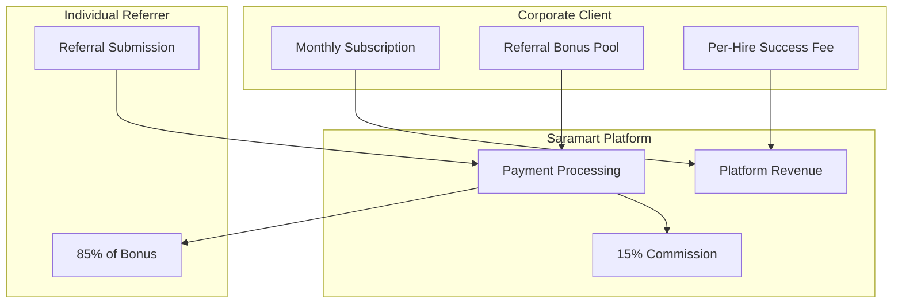
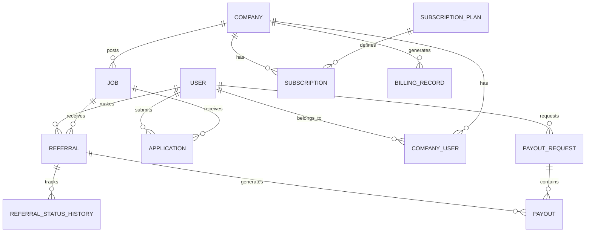
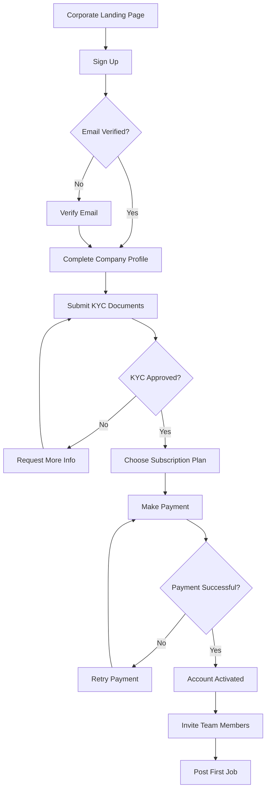
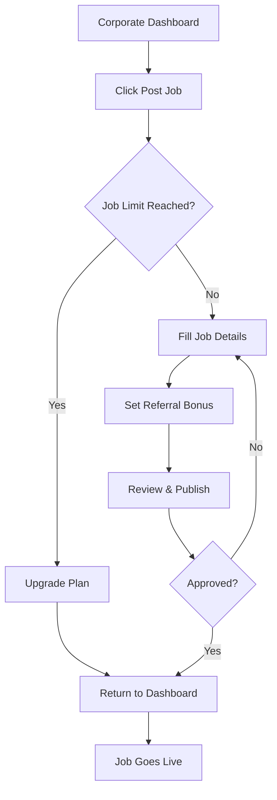
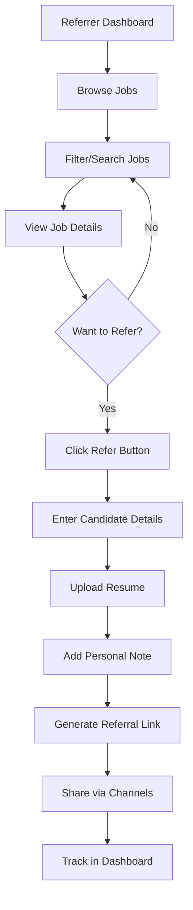
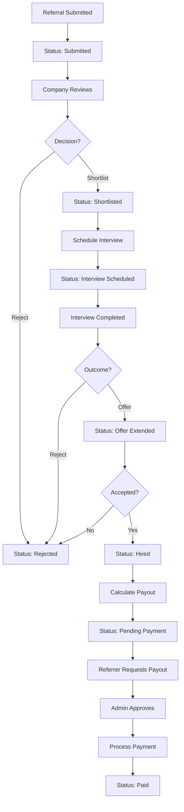
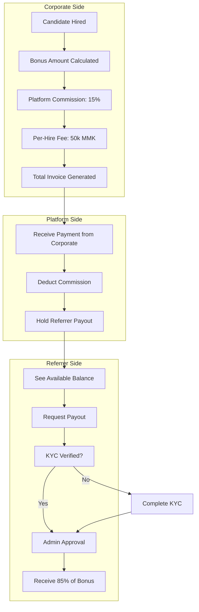
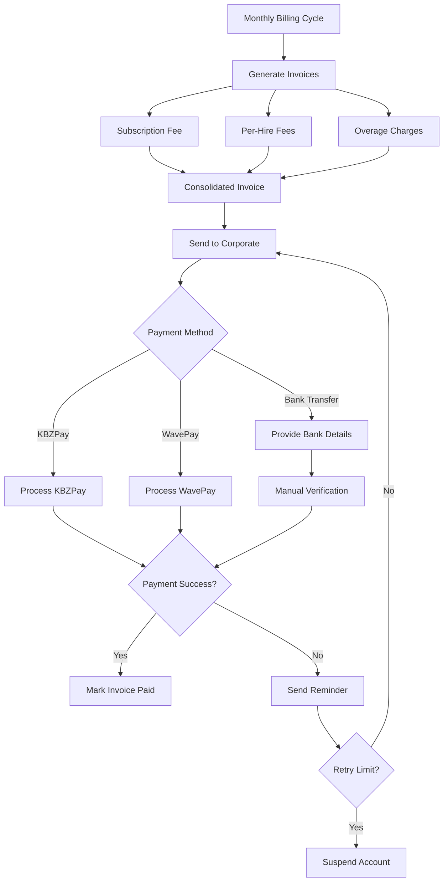

# Saramart Referral Platform - Technical Specification

## Executive Summary

This document provides a comprehensive technical specification for building a referral platform that connects individual referrers with corporate clients. The platform monetizes through corporate subscriptions and per-hire success fees, enabling payment of referral bonuses to individual referrers.

**Target Market**: Myanmar (Primary)
**Currency**: Myanmar Kyat (MMK)
**Payment Methods**: KBZPay, WavePay, Bank Transfers

---

## 1. Business Model & Monetization Strategy

### 1.1 Revenue Streams

| Revenue Stream | Description | Amount |
|---------------|-------------|--------|
| **Platform Commission** | Percentage taken from each referral bonus | 15% |
| **Monthly Subscriptions** | Corporate access tiers | See below |
| **Per-Hire Success Fee** | Fixed fee per successful hire | 50,000 MMK |

### 1.2 Corporate Subscription Tiers

| Tier | Monthly Price | Job Postings | Features |
|------|---------------|--------------|----------|
| **Starter** | 99,000 MMK | 5 active jobs | Basic analytics, email support |
| **Growth** | 299,000 MMK | 20 active jobs | Advanced analytics, priority support, featured listings |
| **Enterprise** | 999,000 MMK | Unlimited | API access, dedicated manager, white-label options |

### 1.3 Financial Flow



### 1.4 Example Transaction

**Scenario**: Referrer successfully refers a candidate for a job with 200,000 MMK bonus

| Party | Amount | Notes |
|-------|--------|-------|
| Corporate pays | 200,000 MMK | Referral bonus |
| Platform commission | 30,000 MMK | 15% of bonus |
| Referrer receives | 170,000 MMK | 85% of bonus |
| Per-hire fee | 50,000 MMK | Additional corporate charge |

---

## 2. User Roles & Permissions System

### 2.1 Role Hierarchy

```
Platform Admin
├── Corporate Admin
│   ├── Corporate Recruiter
│   └── Corporate Viewer
├── Individual Referrer
└── Job Seeker (Candidate)
```

### 2.2 Permission Matrix

| Feature | Platform Admin | Corporate Admin | Corporate Recruiter | Corporate Viewer | Referrer | Job Seeker |
|---------|---------------|-----------------|---------------------|------------------|----------|------------|
| **User Management** |
| Manage all users | ✅ | ❌ | ❌ | ❌ | ❌ | ❌ |
| Manage company users | ✅ | ✅ | ❌ | ❌ | ❌ | ❌ |
| **Job Management** |
| Post jobs (any company) | ✅ | ✅ | ✅ | ❌ | ❌ | ❌ |
| Edit company jobs | ✅ | ✅ | ✅ | ❌ | ❌ | ❌ |
| View all jobs | ✅ | ✅ | ✅ | ✅ | ✅ | ✅ |
| **Referrals** |
| Submit referrals | ❌ | ❌ | ❌ | ❌ | ✅ | ❌ |
| Review referrals | ✅ | ✅ | ✅ | ✅ | ❌ | ❌ |
| Update referral status | ✅ | ✅ | ✅ | ❌ | ❌ | ❌ |
| Track own referrals | ❌ | ❌ | ❌ | ❌ | ✅ | ❌ |
| **Billing** |
| Manage subscriptions | ✅ | ✅ | ❌ | ❌ | ❌ | ❌ |
| View billing history | ✅ | ✅ | ❌ | ❌ | ❌ | ❌ |
| Process payouts | ✅ | ❌ | ❌ | ❌ | ❌ | ❌ |
| Request payout | ❌ | ❌ | ❌ | ❌ | ✅ | ❌ |
| **Analytics** |
| Platform-wide analytics | ✅ | ❌ | ❌ | ❌ | ❌ | ❌ |
| Company analytics | ✅ | ✅ | ✅ | ✅ | ❌ | ❌ |
| Personal analytics | ❌ | ❌ | ❌ | ❌ | ✅ | ❌ |
| **Admin** |
| Configure platform | ✅ | ❌ | ❌ | ❌ | ❌ | ❌ |
| Manage payouts | ✅ | ❌ | ❌ | ❌ | ❌ | ❌ |
| View audit logs | ✅ | ❌ | ❌ | ❌ | ❌ | ❌ |

### 2.3 Role Definitions

#### Platform Admin
- Full system access
- User management across all companies
- Financial oversight and payout processing
- Platform configuration
- Analytics and reporting

#### Corporate Admin
- Company account management
- Team member management (add/remove recruiters/viewers)
- Subscription and billing management
- Full job management access
- Company analytics

#### Corporate Recruiter
- Job posting and management
- Referral review and status updates
- Candidate communication
- Limited analytics (assigned jobs only)

#### Corporate Viewer
- Read-only access to company jobs
- View referrals and analytics
- Cannot modify data

#### Individual Referrer
- Browse available jobs
- Generate referral links
- Track referral status
- View earnings and request payouts
- Access to referral analytics

#### Job Seeker
- Browse and apply to jobs
- Track application status
- No referral capabilities

---

## 3. Database Schema Design

### 3.1 Entity Relationship Diagram



### 3.2 Collection Schemas

#### 3.2.1 Users Collection

```javascript
{
  _id: ObjectId,
  
  // Authentication
  email: String,              // Unique, indexed
  password: String,           // Bcrypt hashed
  
  // Profile
  name: String,
  phone: String,
  avatar: String,             // URL to image
  
  // Role & Type
  role: String,               // Enum: 'platform_admin', 'referrer', 'jobseeker'
  
  // For referrers
  referrerProfile: {
    referralCode: String,     // Unique, auto-generated
    totalEarnings: Number,    // Default: 0
    availableBalance: Number, // Default: 0
    pendingBalance: Number,   // Default: 0
    totalReferrals: Number,   // Default: 0
    successfulHires: Number,  // Default: 0
    paymentMethods: [{
      type: String,           // Enum: 'kbzpay', 'wavepay', 'bank_transfer'
      provider: String,       // Bank name or payment provider
      accountNumber: String,  // Encrypted
      accountName: String,
      isDefault: Boolean
    }],
    kycStatus: String,        // Enum: 'pending', 'verified', 'rejected'
    kycDocuments: {
      nrcFront: String,       // URL
      nrcBack: String,        // URL
      selfie: String          // URL
    }
  },
  
  // For jobseekers
  jobseekerProfile: {
    resume: String,           // URL
    skills: [String],
    experience: String,
    education: String
  },
  
  // Status
  status: String,             // Enum: 'active', 'suspended', 'deleted'
  emailVerified: Boolean,     // Default: false
  
  // Timestamps
  createdAt: Date,
  updatedAt: Date,
  lastLoginAt: Date
}
```

#### 3.2.2 Companies Collection

```javascript
{
  _id: ObjectId,
  
  // Basic Info
  name: String,
  slug: String,               // URL-friendly name, unique
  description: String,
  logo: String,               // URL
  website: String,
  industry: String,
  companySize: String,        // Enum: '1-10', '11-50', '51-200', etc.
  
  // Contact
  email: String,
  phone: String,
  address: {
    street: String,
    city: String,
    state: String,
    country: String           // Default: 'Myanmar'
  },
  
  // Business Registration
  registrationNumber: String,
  taxId: String,
  
  // Verification
  verificationStatus: String, // Enum: 'pending', 'verified', 'rejected'
  verifiedAt: Date,
  
  // Subscription
  currentSubscription: {
    planId: ObjectId,
    status: String,           // Enum: 'active', 'cancelled', 'expired'
    startedAt: Date,
    expiresAt: Date,
    autoRenew: Boolean
  },
  
  // Limits
  jobPostingLimit: Number,
  activeJobCount: Number,     // Default: 0
  
  // Branding
  branding: {
    primaryColor: String,
    bannerImage: String,
    customDomain: String
  },
  
  // Settings
  settings: {
    requireApproval: Boolean, // For job postings
    defaultReferralBonus: Number,
    notificationPreferences: Object
  },
  
  // Stats
  stats: {
    totalJobsPosted: Number,
    totalHires: Number,
    totalReferralSpend: Number,
    totalSpent: Number
  },
  
  // Status
  status: String,             // Enum: 'active', 'suspended', 'deleted'
  
  createdAt: Date,
  updatedAt: Date
}
```

#### 3.2.3 CompanyUsers Collection (Team Members)

```javascript
{
  _id: ObjectId,
  
  userId: ObjectId,           // Reference to Users
  companyId: ObjectId,        // Reference to Companies
  
  // Role within company
  role: String,               // Enum: 'admin', 'recruiter', 'viewer'
  
  // Permissions override (optional)
  permissions: [String],
  
  // Invited by
  invitedBy: ObjectId,
  invitedAt: Date,
  
  // Acceptance
  invitationStatus: String,   // Enum: 'pending', 'accepted', 'declined'
  acceptedAt: Date,
  
  // Department/Team
  department: String,
  
  createdAt: Date,
  updatedAt: Date
}
```

#### 3.2.4 Jobs Collection

```javascript
{
  _id: ObjectId,
  
  // Basic Info
  title: String,
  slug: String,               // URL-friendly
  description: String,        // Rich text/HTML
  
  // Company
  companyId: ObjectId,        // Reference to Companies
  postedBy: ObjectId,         // Reference to Users
  
  // Location
  location: {
    type: String,             // Enum: 'onsite', 'remote', 'hybrid'
    city: String,
    state: String,
    country: String
  },
  
  // Employment Details
  type: String,               // Enum: 'full-time', 'part-time', 'contract', 'internship'
  salary: {
    min: Number,
    max: Number,
    currency: String,         // Default: 'MMK'
    period: String            // Enum: 'monthly', 'yearly'
  },
  
  // Requirements
  requirements: [String],
  responsibilities: [String],
  benefits: [String],
  
  // Referral Settings
  referralBonus: Number,      // Amount in MMK
  bonusCurrency: String,      // Default: 'MMK'
  
  // Status
  status: String,             // Enum: 'draft', 'active', 'paused', 'closed', 'filled'
  
  // Visibility
  isFeatured: Boolean,        // Default: false
  isUrgent: Boolean,          // Default: false
  
  // Application Settings
  applicationSettings: {
    requireResume: Boolean,   // Default: true
    customQuestions: [{
      question: String,
      type: String,           // Enum: 'text', 'select', 'multiselect'
      required: Boolean,
      options: [String]
    }],
    deadline: Date
  },
  
  // Stats
  stats: {
    views: Number,            // Default: 0
    applications: Number,     // Default: 0
    referrals: Number,        // Default: 0
    hires: Number             // Default: 0
  },
  
  // SEO
  metaTitle: String,
  metaDescription: String,
  
  // Timestamps
  publishedAt: Date,
  expiresAt: Date,
  createdAt: Date,
  updatedAt: Date
}
```

#### 3.2.5 Referrals Collection

```javascript
{
  _id: ObjectId,
  
  // Referral Code
  code: String,               // Unique, e.g., "SAR-ABC123"
  
  // Relationships
  jobId: ObjectId,            // Reference to Jobs
  referrerId: ObjectId,       // Reference to Users (referrer)
  
  // Referred Person
  referredPerson: {
    name: String,
    email: String,
    phone: String,
    resumeUrl: String
  },
  
  // Or if registered user
  referredUserId: ObjectId,   // Reference to Users (optional)
  
  // Source tracking
  source: {
    channel: String,          // Enum: 'direct', 'facebook', 'linkedin', 'whatsapp', 'email'
    ipAddress: String,
    userAgent: String,
    referrerUrl: String
  },
  
  // Status Pipeline
  status: String,             /* Enum:
                                - 'submitted'
                                - 'under_review'
                                - 'shortlisted'
                                - 'interview_scheduled'
                                - 'interview_completed'
                                - 'offer_extended'
                                - 'hired'
                                - 'rejected'
                                - 'withdrawn'
                                - 'paid'
                              */
  
  // Status History
  statusHistory: [{
    status: String,
    changedBy: ObjectId,      // User who changed status
    changedAt: Date,
    notes: String
  }],
  
  // Financial
  referralBonus: Number,      // Original bonus amount
  platformCommission: Number, // 15%
  referrerPayout: Number,     // 85%
  perHireFee: Number,         // 50,000 MMK
  
  // Payout
  payout: {
    status: String,           // Enum: 'pending', 'approved', 'processing', 'paid', 'rejected'
    requestedAt: Date,
    approvedAt: Date,
    paidAt: Date,
    paymentMethod: String,
    transactionId: String,
    receiptUrl: String
  },
  
  // Notes
  internalNotes: String,      // Company notes
  referrerNotes: String,      // Notes from referrer
  
  // Timestamps
  submittedAt: Date,
  hiredAt: Date,
  createdAt: Date,
  updatedAt: Date
}
```

#### 3.2.6 Applications Collection (Direct Applications)

```javascript
{
  _id: ObjectId,
  
  jobId: ObjectId,
  applicantId: ObjectId,      // Reference to Users
  
  // Application Details
  fullName: String,
  email: String,
  phone: String,
  resumeUrl: String,
  coverLetter: String,
  
  // Answers to custom questions
  answers: [{
    questionId: String,
    answer: String
  }],
  
  // Status
  status: String,             // Enum: 'submitted', 'reviewed', 'shortlisted', 'rejected', 'hired'
  
  // Timestamps
  submittedAt: Date,
  reviewedAt: Date,
  createdAt: Date,
  updatedAt: Date
}
```

#### 3.2.7 SubscriptionPlans Collection

```javascript
{
  _id: ObjectId,
  
  // Plan Details
  name: String,               // e.g., 'Starter', 'Growth', 'Enterprise'
  slug: String,               // URL-friendly
  description: String,
  
  // Pricing
  price: Number,              // Monthly price in MMK
  currency: String,           // Default: 'MMK'
  billingCycle: String,       // Enum: 'monthly', 'yearly'
  yearlyDiscount: Number,     // Percentage discount
  
  // Limits
  features: {
    jobPostingLimit: Number,  // -1 for unlimited
    userLimit: Number,        // Team members
    storageLimit: Number,     // In MB
    apiAccess: Boolean,
    prioritySupport: Boolean,
    customBranding: Boolean,
    whiteLabel: Boolean
  },
  
  // Feature Flags
  includedFeatures: [String],
  
  // Display
  isPopular: Boolean,         // Highlight on pricing page
  displayOrder: Number,
  
  // Status
  isActive: Boolean,          // Default: true
  
  createdAt: Date,
  updatedAt: Date
}
```

#### 3.2.8 Subscriptions Collection

```javascript
{
  _id: ObjectId,
  
  companyId: ObjectId,
  planId: ObjectId,
  
  // Billing
  status: String,             // Enum: 'active', 'cancelled', 'expired', 'past_due'
  
  // Period
  currentPeriodStart: Date,
  currentPeriodEnd: Date,
  
  // Pricing at time of subscription
  price: Number,
  currency: String,
  
  // Payment
  paymentMethod: String,      // Enum: 'kbzpay', 'wavepay', 'bank_transfer'
  
  // Renewal
  autoRenew: Boolean,         // Default: true
  cancelAtPeriodEnd: Boolean, // Default: false
  
  // Cancellation
  cancelledAt: Date,
  cancellationReason: String,
  
  // Trial
  trialEndsAt: Date,
  
  createdAt: Date,
  updatedAt: Date
}
```

#### 3.2.9 BillingRecords Collection

```javascript
{
  _id: ObjectId,
  
  companyId: ObjectId,
  subscriptionId: ObjectId,   // Optional
  
  // Invoice Details
  invoiceNumber: String,      // e.g., "INV-2024-0001"
  
  // Charges
  items: [{
    description: String,
    type: String,             // Enum: 'subscription', 'per_hire_fee', 'overage'
    quantity: Number,
    unitPrice: Number,
    amount: Number
  }],
  
  subtotal: Number,
  tax: Number,
  total: Number,
  currency: String,
  
  // Status
  status: String,             // Enum: 'pending', 'paid', 'failed', 'refunded'
  
  // Payment
  paymentMethod: String,
  paidAt: Date,
  transactionId: String,
  
  // Due date
  dueDate: Date,
  
  createdAt: Date,
  updatedAt: Date
}
```

#### 3.2.10 PayoutRequests Collection

```javascript
{
  _id: ObjectId,
  
  referrerId: ObjectId,
  
  // Amount
  amount: Number,
  currency: String,
  
  // Referrals included in this payout
  referrals: [{
    referralId: ObjectId,
    amount: Number
  }],
  
  // Payment Method
  paymentMethod: {
    type: String,             // Enum: 'kbzpay', 'wavepay', 'bank_transfer'
    details: Object           // Encrypted account details
  },
  
  // Status
  status: String,             // Enum: 'pending', 'approved', 'processing', 'paid', 'rejected'
  
  // Processing
  requestedAt: Date,
  approvedBy: ObjectId,
  approvedAt: Date,
  processedBy: ObjectId,
  processedAt: Date,
  
  // Payment
  transactionId: String,
  receiptUrl: String,
  
  // Rejection reason
  rejectionReason: String,
  
  // Notes
  notes: String,
  
  createdAt: Date,
  updatedAt: Date
}
```

#### 3.2.11 AuditLogs Collection

```javascript
{
  _id: ObjectId,
  
  // Who
  userId: ObjectId,           // Optional (system actions)
  userType: String,           // 'platform_admin', 'corporate', 'referrer'
  
  // What
  action: String,             // Enum: 'create', 'update', 'delete', 'login', 'payment', etc.
  entityType: String,         // 'user', 'job', 'referral', 'company', etc.
  entityId: ObjectId,
  
  // Details
  changes: {
    before: Object,
    after: Object
  },
  
  // Context
  ipAddress: String,
  userAgent: String,
  
  createdAt: Date
}
```

### 3.3 Indexes

```javascript
// Users
users.createIndex({ email: 1 }, { unique: true })
users.createIndex({ "referrerProfile.referralCode": 1 }, { unique: true, sparse: true })
users.createIndex({ role: 1, status: 1 })

// Companies
companies.createIndex({ slug: 1 }, { unique: true })
companies.createIndex({ "currentSubscription.status": 1 })
companies.createIndex({ verificationStatus: 1 })

// Jobs
jobs.createIndex({ companyId: 1, status: 1 })
jobs.createIndex({ status: 1, isFeatured: 1, createdAt: -1 })
jobs.createIndex({ title: 'text', description: 'text' })  // Full-text search

// Referrals
referrals.createIndex({ code: 1 }, { unique: true })
referrals.createIndex({ referrerId: 1, status: 1 })
referrals.createIndex({ jobId: 1, status: 1 })
referrals.createIndex({ status: 1, "payout.status": 1 })

// Subscriptions
subscriptions.createIndex({ companyId: 1, status: 1 })
subscriptions.createIndex({ currentPeriodEnd: 1, status: 1 })

// Audit Logs
auditLogs.createIndex({ userId: 1, createdAt: -1 })
auditLogs.createIndex({ entityType: 1, entityId: 1 })
auditLogs.createIndex({ createdAt: -1 }, { expireAfterSeconds: 2592000 })  // TTL 30 days
```

---

## 4. API Architecture

### 4.1 API Structure

```
/api/v1
├── /auth
│   ├── POST /register
│   ├── POST /login
│   ├── POST /logout
│   ├── POST /refresh
│   ├── POST /forgot-password
│   ├── POST /reset-password
│   └── GET  /me
├── /users
│   ├── GET    /                    # List (admin only)
│   ├── GET    /:id
│   ├── PUT    /:id
│   ├── DELETE /:id
│   ├── PUT    /:id/profile
│   ├── POST   /:id/kyc
│   └── GET    /:id/referrals
├── /companies
│   ├── GET    /                    # List with filters
│   ├── POST   /                    # Create (admin)
│   ├── GET    /:id
│   ├── PUT    /:id
│   ├── DELETE /:id
│   ├── GET    /:id/jobs
│   ├── GET    /:id/team
│   ├── POST   /:id/team            # Invite member
│   ├── DELETE /:id/team/:userId
│   ├── GET    /:id/billing
│   └── GET    /:id/analytics
├── /jobs
│   ├── GET    /                    # List with filters
│   ├── POST   /                    # Create job
│   ├── GET    /:id
│   ├── PUT    /:id
│   ├── DELETE /:id
│   ├── POST   /:id/apply           # Direct application
│   ├── POST   /:id/refer           # Generate referral
│   └── GET    /:id/referrals       # List referrals (company only)
├── /referrals
│   ├── GET    /                    # My referrals (referrer)
│   ├── GET    /:code               # Get by code
│   ├── POST   /                    # Submit referral
│   ├── GET    /:id
│   ├── PUT    /:id/status          # Update status
│   ├── POST   /:id/notes
│   └── GET    /track/:code         # Public tracking
├── /applications
│   ├── GET    /my
│   ├── GET    /:id
│   └── PUT    /:id/status
├── /subscriptions
│   ├── GET    /plans
│   ├── POST   /subscribe
│   ├── POST   /upgrade
│   ├── POST   /cancel
│   └── GET    /:companyId/invoices
├── /billing
│   ├── GET    /invoices
│   ├── GET    /invoices/:id
│   ├── POST   /invoices/:id/pay
│   └── GET    /payment-methods
├── /payouts
│   ├── GET    /balance
│   ├── GET    /history
│   ├── POST   /request
│   ├── GET    /requests            # Admin only
│   └── PUT    /requests/:id        # Approve/reject (admin)
├── /analytics
│   ├── GET    /platform            # Admin only
│   ├── GET    /company/:id
│   └── GET    /personal
├── /admin
│   ├── GET    /dashboard
│   ├── GET    /users
│   ├── GET    /companies
│   ├── GET    /referrals
│   ├── GET    /payouts
│   ├── PUT    /payouts/:id
│   ├── GET    /settings
│   └── PUT    /settings
└── /webhooks
    ├── POST /kbzpay
    ├── POST /wavepay
    └── POST /bank-transfer
```

### 4.2 Key API Endpoints

#### Authentication

```typescript
// POST /api/v1/auth/register
interface RegisterRequest {
  email: string
  password: string
  name: string
  role: 'referrer' | 'jobseeker'
  phone?: string
}

interface RegisterResponse {
  user: User
  token: string
  refreshToken: string
}

// POST /api/v1/auth/login
interface LoginRequest {
  email: string
  password: string
}

interface LoginResponse {
  user: User
  token: string
  refreshToken: string
}
```

#### Jobs

```typescript
// GET /api/v1/jobs
interface ListJobsQuery {
  page?: number
  limit?: number
  search?: string
  location?: string
  type?: string
  category?: string
  salaryMin?: number
  salaryMax?: number
  company?: string
  isFeatured?: boolean
  sortBy?: 'newest' | 'salary' | 'relevance'
}

interface ListJobsResponse {
  jobs: Job[]
  pagination: {
    page: number
    limit: number
    total: number
    totalPages: number
  }
}

// POST /api/v1/jobs
interface CreateJobRequest {
  title: string
  description: string
  location: {
    type: 'onsite' | 'remote' | 'hybrid'
    city: string
    state?: string
  }
  type: 'full-time' | 'part-time' | 'contract' | 'internship'
  salary: {
    min: number
    max: number
    currency?: string
  }
  requirements: string[]
  responsibilities?: string[]
  benefits?: string[]
  referralBonus: number
  applicationSettings?: {
    requireResume?: boolean
    customQuestions?: CustomQuestion[]
    deadline?: Date
  }
}
```

#### Referrals

```typescript
// POST /api/v1/referrals
interface CreateReferralRequest {
  jobId: string
  referredPerson: {
    name: string
    email: string
    phone: string
    resume?: File
  }
  notes?: string
}

interface CreateReferralResponse {
  referral: Referral
  referralLink: string
  code: string
}

// PUT /api/v1/referrals/:id/status
interface UpdateReferralStatusRequest {
  status: ReferralStatus
  notes?: string
}

// Referral Status Enum
type ReferralStatus = 
  | 'submitted'
  | 'under_review'
  | 'shortlisted'
  | 'interview_scheduled'
  | 'interview_completed'
  | 'offer_extended'
  | 'hired'
  | 'rejected'
  | 'withdrawn'
  | 'paid'
```

#### Subscriptions

```typescript
// GET /api/v1/subscriptions/plans
interface ListPlansResponse {
  plans: SubscriptionPlan[]
}

// POST /api/v1/subscriptions/subscribe
interface SubscribeRequest {
  planId: string
  paymentMethod: 'kbzpay' | 'wavepay' | 'bank_transfer'
  paymentDetails: PaymentDetails
  billingCycle: 'monthly' | 'yearly'
}

// POST /api/v1/subscriptions/upgrade
interface UpgradeRequest {
  newPlanId: string
  proration?: boolean
}
```

#### Payouts

```typescript
// GET /api/v1/payouts/balance
interface GetBalanceResponse {
  availableBalance: number
  pendingBalance: number
  totalEarnings: number
  currency: string
}

// POST /api/v1/payouts/request
interface RequestPayoutRequest {
  amount: number
  paymentMethod: 'kbzpay' | 'wavepay' | 'bank_transfer'
  paymentDetails: PaymentDetails
}

// PUT /api/v1/payouts/requests/:id (Admin)
interface ProcessPayoutRequest {
  status: 'approved' | 'rejected'
  notes?: string
  transactionId?: string
}
```

### 4.3 Middleware Stack

```javascript
// Request Flow
Request
  → Rate Limiter
  → CORS
  → Body Parser
  → Authentication (JWT)
  → Authorization (RBAC)
  → Validation (Joi/Zod)
  → Route Handler
  → Response

// Error Handling
Error
  → Error Middleware
  → Log to Audit
  → Format Response
  → Send to Client
```

### 4.4 Authentication & Authorization

```javascript
// JWT Token Structure
{
  header: {
    alg: "HS256",
    typ: "JWT"
  },
  payload: {
    sub: "user_id",
    role: "referrer",
    companyId: "company_id",  // For corporate users
    permissions: ["read:jobs", "write:referrals"],
    iat: 1234567890,
    exp: 1234571490
  }
}

// Permission Format
"action:resource"
Examples:
- "read:jobs"           // View jobs
- "write:jobs"          // Create/edit jobs
- "read:referrals"      // View referrals
- "write:referrals"     // Update referral status
- "admin:users"         // Full user management
- "admin:payouts"       // Process payouts
```

---

## 5. User Flows & Workflows

### 5.1 Corporate Onboarding Flow



### 5.2 Job Posting Flow



### 5.3 Referrer Job Discovery & Referral Flow



### 5.4 Referral Lifecycle Flow



### 5.5 Bonus Payment Workflow



### 5.6 Corporate Billing Flow



---

## 6. Implementation Roadmap

### Phase 1: Foundation (Weeks 1-3)
**Goal**: Core platform infrastructure and basic functionality

| Week | Tasks |
|------|-------|
| **Week 1** | • Refactor database schemas<br>• Implement enhanced user authentication<br>• Set up RBAC middleware<br>• Create company management APIs |
| **Week 2** | • Build job posting system<br>• Implement job search and filtering<br>• Create company dashboard<br>• Set up file upload (resumes) |
| **Week 3** | • Build referrer dashboard<br>• Implement referral creation<br>• Create referral tracking system<br>• Basic analytics |

**Deliverables**:
- User registration/login with roles
- Company onboarding flow
- Job posting and discovery
- Basic referral submission

---

### Phase 2: Monetization (Weeks 4-6)
**Goal**: Payment processing and subscription management

| Week | Tasks |
|------|-------|
| **Week 4** | • Design subscription plans<br>• Implement KBZPay integration<br>• Implement WavePay integration<br>• Create billing system |
| **Week 5** | • Build subscription management UI<br>• Implement invoice generation<br>• Create payment history<br>• Set up payment webhooks |
| **Week 6** | • Implement job posting limits<br>• Create upgrade/ downgrade flows<br>• Build billing dashboard<br>• Test payment flows |

**Deliverables**:
- Subscription plans and pricing
- Payment gateway integrations
- Billing and invoicing system
- Subscription management

---

### Phase 3: Referral Engine (Weeks 7-9)
**Goal**: Complete referral lifecycle management

| Week | Tasks |
|------|-------|
| **Week 7** | • Implement referral status pipeline<br>• Build status update notifications<br>• Create referral history tracking<br>• Implement referral analytics |
| **Week 8** | • Build corporate referral management<br>• Create interview scheduling<br>• Implement offer tracking<br>• Build hire confirmation flow |
| **Week 9** | • Calculate bonuses and commissions<br>• Implement per-hire fees<br>• Create financial reporting<br>• Test complete referral flow |

**Deliverables**:
- Full referral status pipeline
- Corporate referral management
- Bonus calculation system
- Financial tracking

---

### Phase 4: Payout System (Weeks 10-11)
**Goal**: Referrer payment processing

| Week | Tasks |
|------|-------|
| **Week 10** | • Build KYC verification system<br>• Implement payment method management<br>• Create payout request flow<br>• Build admin payout dashboard |
| **Week 11** | • Implement payout processing<br>• Create payout history<br>• Build earnings dashboard<br>• Test payout flows |

**Deliverables**:
- KYC verification
- Payout request and processing
- Earnings tracking
- Admin payout management

---

### Phase 5: Admin & Analytics (Weeks 12-13)
**Goal**: Platform administration and insights

| Week | Tasks |
|------|-------|
| **Week 12** | • Build admin dashboard<br>• Implement user management<br>• Create company management<br>• Build KYC review system |
| **Week 13** | • Implement platform analytics<br>• Create reporting system<br>• Build audit logging<br>• Set up monitoring |

**Deliverables**:
- Admin dashboard
- User/company management
- Platform analytics
- Audit logs

---

### Phase 6: Polish & Launch (Weeks 14-15)
**Goal**: Testing, optimization, and launch preparation

| Week | Tasks |
|------|-------|
| **Week 14** | • End-to-end testing<br>• Performance optimization<br>• Security audit<br>• Bug fixes |
| **Week 15** | • Documentation<br>• User onboarding guides<br>• Soft launch<br>• Gather feedback |

**Deliverables**:
- Fully tested platform
- Documentation
- Launch-ready product

---

## 7. Technical Specifications

### 7.1 Technology Stack

| Layer | Technology | Purpose |
|-------|------------|---------|
| **Frontend** | React + TypeScript | UI framework |
| **Styling** | Tailwind CSS | Utility-first CSS |
| **Animation** | Framer Motion | UI animations |
| **State Management** | React Query + Zustand | Server & client state |
| **Backend** | Node.js + Express | API server |
| **Database** | MongoDB Atlas | Primary database |
| **ODM** | Mongoose | MongoDB modeling |
| **Authentication** | JWT + bcrypt | Auth & security |
| **File Storage** | AWS S3 / Cloudinary | Resume & document storage |
| **Payments** | KBZPay API, WavePay API | Payment processing |
| **Email** | SendGrid / AWS SES | Transactional emails |
| **SMS** | Twilio / Local provider | OTP & notifications |
| **Queue** | Bull + Redis | Background jobs |
| **Monitoring** | Sentry + LogRocket | Error tracking |
| **Analytics** | Mixpanel / Amplitude | User analytics |

### 7.2 Environment Variables

```bash
# Database
MONGODB_URI=mongodb+srv://...

# JWT
JWT_SECRET=your-super-secret-key
JWT_EXPIRE=30d

# Server
PORT=3001
NODE_ENV=production

# File Upload
AWS_ACCESS_KEY_ID=...
AWS_SECRET_ACCESS_KEY=...
AWS_S3_BUCKET=...

# Payments
KBZPAY_MERCHANT_ID=...
KBZPAY_API_KEY=...
WAVEPAY_MERCHANT_ID=...
WAVEPAY_API_KEY=...

# Email
SENDGRID_API_KEY=...
EMAIL_FROM=noreply@saramart.com

# SMS
TWILIO_ACCOUNT_SID=...
TWILIO_AUTH_TOKEN=...
TWILIO_PHONE_NUMBER=...

# Redis (for queues)
REDIS_URL=redis://...

# Frontend URL
CLIENT_URL=https://saramart.com
```

### 7.3 Security Considerations

1. **Authentication**
   - JWT with short expiration (access token: 15min, refresh token: 7 days)
   - Password hashing with bcrypt (cost factor: 12)
   - Rate limiting on auth endpoints
   - Account lockout after failed attempts

2. **Authorization**
   - RBAC middleware on all protected routes
   - Resource-level permissions (can only access own data)
   - API key authentication for corporate integrations

3. **Data Protection**
   - Encryption at rest (MongoDB Atlas)
   - TLS 1.3 for data in transit
   - PII encryption (payment details, NRC numbers)
   - Field-level encryption for sensitive data

4. **File Uploads**
   - File type validation (PDF, DOC, DOCX only)
   - File size limits (5MB max)
   - Virus scanning (ClamAV)
   - Secure signed URLs for access

5. **Payment Security**
   - PCI DSS compliance for payment handling
   - Webhook signature verification
   - Idempotency keys for payment requests
   - Fraud detection rules

6. **Audit & Monitoring**
   - Comprehensive audit logging
   - Real-time security alerts
   - Automated vulnerability scanning
   - Regular penetration testing

### 7.4 Performance Targets

| Metric | Target |
|--------|--------|
| Page Load Time | < 2 seconds |
| API Response Time | < 200ms (p95) |
| Database Query Time | < 50ms |
| File Upload Time | < 5 seconds |
| Payment Processing | < 10 seconds |
| Concurrent Users | 10,000+ |
| Uptime | 99.9% |

### 7.5 Scalability Strategy

1. **Database**
   - MongoDB sharding for horizontal scaling
   - Read replicas for analytics queries
   - Connection pooling

2. **Application**
   - Stateless API servers (horizontal scaling)
   - Load balancing (Nginx/ALB)
   - Caching layer (Redis)

3. **File Storage**
   - CDN for static assets (CloudFront)
   - S3 for document storage
   - Image optimization pipeline

4. **Background Jobs**
   - Queue-based processing (Bull)
   - Separate worker processes
   - Job retry mechanisms

---

## 8. Data Models Summary

### 8.1 Core Entities

| Entity | Description | Key Relationships |
|--------|-------------|-------------------|
| **User** | Platform users (referrers, jobseekers, admins) | Has referrals, applications, payouts |
| **Company** | Corporate clients | Has jobs, subscriptions, team members |
| **CompanyUser** | Team members within companies | Links User to Company with role |
| **Job** | Job postings | Belongs to Company, has referrals |
| **Referral** | Referral submissions | Links Referrer to Job |
| **Application** | Direct job applications | Links Jobseeker to Job |
| **Subscription** | Active company subscriptions | Links Company to Plan |
| **BillingRecord** | Invoices and payments | Belongs to Company |
| **PayoutRequest** | Referrer payout requests | Contains multiple Referrals |
| **AuditLog** | Activity tracking | References any entity |

### 8.2 State Machines

#### Referral Status
```
submitted → under_review → shortlisted → interview_scheduled → 
interview_completed → offer_extended → hired → paid

Any status → rejected
Any status → withdrawn (before hired)
```

#### Payout Status
```
pending → approved → processing → paid
pending → rejected
```

#### Subscription Status
```
pending → active → cancelled/expired
active → past_due → suspended
```

---

## 9. API Response Standards

### 9.1 Success Response

```json
{
  "success": true,
  "data": {
    // Response data
  },
  "meta": {
    "page": 1,
    "limit": 20,
    "total": 100,
    "totalPages": 5
  }
}
```

### 9.2 Error Response

```json
{
  "success": false,
  "error": {
    "code": "VALIDATION_ERROR",
    "message": "Invalid input data",
    "details": [
      {
        "field": "email",
        "message": "Email is required"
      }
    ]
  }
}
```

### 9.3 Error Codes

| Code | HTTP Status | Description |
|------|-------------|-------------|
| `UNAUTHORIZED` | 401 | Authentication required |
| `FORBIDDEN` | 403 | Insufficient permissions |
| `NOT_FOUND` | 404 | Resource not found |
| `VALIDATION_ERROR` | 400 | Invalid input data |
| `RATE_LIMITED` | 429 | Too many requests |
| `PAYMENT_REQUIRED` | 402 | Payment needed |
| `CONFLICT` | 409 | Resource already exists |
| `INTERNAL_ERROR` | 500 | Server error |

---

## 10. Testing Strategy

### 10.1 Test Types

| Type | Tools | Coverage Target |
|------|-------|-----------------|
| Unit Tests | Jest | 80%+ |
| Integration Tests | Supertest | Critical paths |
| E2E Tests | Cypress | User flows |
| Load Tests | k6 | API endpoints |
| Security Tests | OWASP ZAP | Quarterly |

### 10.2 Critical Test Scenarios

1. **Authentication**
   - Registration with all user types
   - Login/logout flows
   - Password reset
   - Token refresh

2. **Referral Flow**
   - Complete referral lifecycle
   - Status transitions
   - Bonus calculations
   - Payout processing

3. **Payments**
   - Subscription creation
   - Payment success/failure
   - Webhook handling
   - Invoice generation

4. **Permissions**
   - Role-based access control
   - Resource ownership
   - Admin overrides

---

## 11. Deployment Architecture

```
┌─────────────────────────────────────────────────────────────┐
│                         CDN                                  │
│              (CloudFront - Static Assets)                   │
└─────────────────────────────────────────────────────────────┘
                              │
                              ▼
┌─────────────────────────────────────────────────────────────┐
│                     Load Balancer                            │
│                  (AWS ALB / Nginx)                          │
└─────────────────────────────────────────────────────────────┘
                              │
            ┌─────────────────┼─────────────────┐
            ▼                 ▼                 ▼
    ┌──────────────┐  ┌──────────────┐  ┌──────────────┐
    │  API Server  │  │  API Server  │  │  API Server  │
    │     (1)      │  │     (2)      │  │     (N)      │
    └──────────────┘  └──────────────┘  └──────────────┘
            │                 │                 │
            └─────────────────┼─────────────────┘
                              ▼
    ┌─────────────────────────────────────────────────────────┐
    │                    Redis Cluster                        │
    │              (Caching + Session Store)                  │
    └─────────────────────────────────────────────────────────┘
                              │
            ┌─────────────────┼─────────────────┐
            ▼                 ▼                 ▼
    ┌──────────────┐  ┌──────────────┐  ┌──────────────┐
    │  MongoDB     │  │  S3 Bucket   │  │  Worker      │
    │  Atlas       │  │  (Files)     │  │  Processes   │
    │  (Primary)   │  │              │  │  (Queues)    │
    └──────────────┘  └──────────────┘  └──────────────┘
```

---

## 12. Monitoring & Alerting

### 12.1 Key Metrics

| Category | Metrics |
|----------|---------|
| **Application** | Response time, error rate, throughput |
| **Business** | New signups, referrals, hires, revenue |
| **Infrastructure** | CPU, memory, disk, network |
| **Database** | Query time, connection pool, replication lag |
| **Payments** | Success rate, failure reasons, refunds |

### 12.2 Alert Thresholds

| Metric | Warning | Critical |
|--------|---------|----------|
| API Response Time | > 500ms | > 1s |
| Error Rate | > 1% | > 5% |
| CPU Usage | > 70% | > 90% |
| Memory Usage | > 80% | > 95% |
| Payment Failures | > 5% | > 10% |

---

## 13. Appendix

### 13.1 Glossary

| Term | Definition |
|------|------------|
| **Referrer** | Individual who refers candidates for jobs |
| **Corporate** | Company posting jobs on the platform |
| **Referral Bonus** | Amount paid for successful hire |
| **Platform Commission** | Percentage kept by platform (15%) |
| **Per-Hire Fee** | Fixed fee charged per successful hire (50k MMK) |
| **KYC** | Know Your Customer - identity verification |
| **RBAC** | Role-Based Access Control |

### 13.2 Myanmar-Specific Considerations

1. **Payment Methods**
   - KBZPay integration
   - WavePay integration
   - Bank transfer support (major Myanmar banks)
   - Cash payment option for corporate

2. **Compliance**
   - Myanmar tax regulations
   - Data localization requirements
   - Employment law compliance

3. **Localization**
   - Myanmar language support
   - MMK currency formatting
   - Local phone number validation
   - NRC (National Registration Card) verification

---

## Document Information

| Property | Value |
|----------|-------|
| Version | 1.0 |
| Created | 2026-01-31 |
| Author | Saramart Technical Team |
| Status | Draft |

---

*This specification is a living document and will be updated as the platform evolves.*
